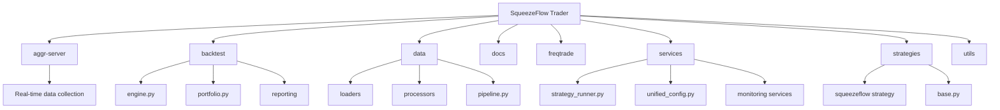
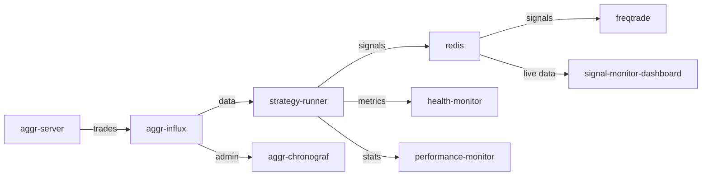

# SqueezeFlow Trader

**Professional Cryptocurrency Trading System with Modular Backtest Engine and CVD-Divergence Squeeze Detection**

[](https://python.org/downloads/)
[](https://www.docker.com/)
[](https://opensource.org/licenses/MIT)
[](#testing)
[](#development)

## 🎯 Core Concept

SqueezeFlow Trader detects market "squeeze" conditions through **Cumulative Volume Delta (CVD) divergence analysis** between spot and futures markets. The system identifies high-probability trading opportunities by analyzing volume flow patterns across multiple exchanges using a sophisticated multi-timeframe approach.

## 🚀 System Overview

**Professional Trading System** - Advanced cryptocurrency trading with CVD-based squeeze detection

- **Unlimited Asset Support**: Trade any cryptocurrency pair across supported exchanges
- **Real-Time Processing**: Low-latency signal generation and execution
- **Complete Integration**: Full pipeline from market data collection to automated trade execution
- **Scalable Architecture**: Docker-based microservices with comprehensive monitoring

### Squeeze Detection Algorithm

- **Long Squeeze**: Price ↑ + Spot CVD ↑ + Futures CVD ↓ → Negative Score (Buy Signal)
- **Short Squeeze**: Price ↓ + Spot CVD ↓ + Futures CVD ↑ → Positive Score (Sell Signal)
- **CVD Methodology**: Industry-standard `(buy_volume - sell_volume).cumsum()` verified against aggr.trade and professional platforms
- **Multi-Timeframe Analysis**: 1m to 4h (1m, 5m, 15m, 30m, 1h, 4h) with automated continuous query aggregation

## 🏗️ System Architecture

### Project Structure



### Microservices Data Pipeline
```
Exchange APIs → aggr-server → InfluxDB → Multi-Timeframe CQs → Symbol/Market Discovery → Strategy Runner → Redis → FreqTrade → Order Execution
                                    ↓
                            Modular Backtest Engine → Strategy Testing → Performance Analysis
```

### Core Components

#### 🔧 **Backtest Engine** (`/backtest/`)
Advanced rolling window backtesting system for realistic strategy validation:

- `engine.py` - Main backtest orchestrator with rolling window processing
- `core/portfolio.py` - Portfolio management and position tracking
- `reporting/` - HTML reports, charts, and performance metrics
- `results/` - Backtest outputs and historical runs

**Rolling Window Processing**: The backtest engine processes data in 4-hour rolling windows, stepping forward 5 minutes at a time to match live trading behavior and eliminate lookahead bias. This ensures reset detection and all strategy phases work correctly with realistic data flow.

#### 📊 **Trading Strategy** (`/strategies/squeezeflow/`)
5-phase trading methodology implementation:

- `strategy.py` - Main strategy class
- `components/` - Phase implementations (context, divergence, reset, scoring, exits)
- `config.py` - Strategy parameters and thresholds
- `baseline_manager.py` - CVD baseline tracking

#### 📊 **Data Infrastructure**
Multi-timeframe architecture with automated aggregation:

- **Base Data**: 1-minute OHLCV + Volume from aggr-server
- **Continuous Queries**: 5 automated CQs creating higher timeframes (5m, 15m, 30m, 1h, 4h)
- **Data Retention**: 30-day rolling window with efficient storage
- **CVD Integration**: Industry-verified cumulative calculations with proper normalization

#### 🎯 **Market Discovery System** (`utils/`)
Data-driven discovery for robust market detection:

- **Symbol Discovery**: Automatic detection from InfluxDB with quality validation
- **Market Discovery**: Robust SPOT/PERP classification via Exchange Mapper  
- **OI Discovery**: Open Interest symbol mapping for comprehensive analysis
- **Quality Assurance**: Minimum 500 data points in 24h requirement with coverage validation

#### 🧮 **Professional Trading Strategy**
Complete implementation documented in [`docs/squeezeflow_strategy.md`](docs/squeezeflow_strategy.md)

The strategy follows a sophisticated 5-phase methodology:
1. **Context Assessment**: Multi-timeframe environment analysis (1h/4h timeframes)
2. **Divergence Detection**: CVD imbalance identification between spot and futures
3. **Reset Detection**: Market equilibrium recognition and convergence exhaustion
4. **Entry Signal**: Precise timing with 10-point scoring system and absorption confirmation
5. **Position Management**: Flow-following exit logic without fixed targets

**Key Documentation:**
- **[Complete Strategy Guide](docs/squeezeflow_strategy.md)**: 478-line comprehensive methodology
- **[CVD Calculation Methods](docs/cvd_baseline_tracking.md)**: Mathematical foundations and verification
- **[Signal Generation Process](docs/signal_generation_workflow.md)**: End-to-end pipeline documentation

## 🚀 Quick Start

### Prerequisites
- Python 3.8+
- Docker & Docker Compose
- 4GB+ RAM, 50GB+ disk space

### 1. System Setup
```bash
# Clone repository
git clone https://github.com/unRekable/SqueezeFlow-Trader.git
cd SqueezeFlow-Trader

# Initialize system (configuration in docker-compose.yml)
python init.py --mode development

# Validate complete setup
python validate_setup.py
```

### 2. Start Services
```bash
# Development mode with dry-run safety
python main.py start --dry-run

# Full production deployment
./start.sh

# Start monitoring services specifically
./scripts/start_monitoring.sh

# Start signal monitoring dashboard
docker-compose up -d signal-monitor-dashboard

# System health monitoring
python status.py

# Check current configuration
docker exec squeezeflow-strategy-runner env | grep -E "SQUEEZEFLOW|REDIS|INFLUX|FREQTRADE"
```

### 3. Access Interfaces
- **FreqTrade UI**: http://localhost:8080
- **Health Monitor**: http://localhost:8090
- **Signal Dashboard**: `docker attach squeezeflow-signal-dashboard`
- **aggr-server**: http://localhost:3000
- **Chronograf**: http://localhost:8885

## 🧪 Testing & Validation

### Running Backtests
```bash
# Run backtest with default settings (rolling window processing)
python run_backtest.py

# Backtest with specific timeframe
python run_backtest.py last_week
python run_backtest.py last_month

# Direct backtest engine usage
python backtest/engine.py --symbol BTCUSDT --start-date 2024-08-01 --end-date 2024-08-04
```

**Rolling Window Backtests**: All backtests now use rolling window processing by default, which:
- Processes data in 4-hour windows moving forward 5 minutes at a time
- Eliminates lookahead bias by only showing data up to the current time
- Matches live trading behavior exactly for realistic results
- Fixes reset detection issues that occurred with full dataset processing

### System Testing
```bash
# System validation
python validate_setup.py

# Component health checks
python status.py
```

### System Validation
```bash
# Complete infrastructure check
python validate_setup.py

# Component health monitoring  
python status.py

# CVD analysis for any symbol/timeframe
python utils/cvd_analysis_tool.py BTC --hours 24 --timeframe 5m
```

## 👩‍💻 For Developers

The SqueezeFlow Trader system is designed with developers in mind, providing comprehensive documentation, modular architecture, and extensive customization options.

### 🚀 **Getting Started for Development**

1. **Architecture Overview**: Start with [System Architecture (CLAUDE.md)](CLAUDE.md) for complete technical specifications
2. **Service Design**: Review [Services Architecture](docs/services_architecture.md) for microservices patterns
3. **Strategy Development**: Study [Backtest Engine](docs/backtest_engine.md) for strategy framework
4. **Signal Processing**: Understand [Signal Generation Workflow](docs/signal_generation_workflow.md) for data pipeline

### 🏗️ **Development Resources**

#### **Core Documentation**
- **[CLAUDE.md](CLAUDE.md)**: Complete technical reference (500+ lines) - Your primary development guide
- **[Services Architecture](docs/services_architecture.md)**: Microservices design patterns and API specifications
- **[Backtest Engine](docs/backtest_engine.md)**: Modular testing framework for strategy development

#### **Customization Guides**
- **[Trading Strategy Development](docs/squeezeflow_strategy.md)**: 5-phase methodology implementation
- **[CVD Calculation Methods](docs/cvd_baseline_tracking.md)**: Mathematical foundations and customization
- **[Signal Pipeline Customization](docs/signal_generation_workflow.md)**: End-to-end processing flow

### 🛠️ **Development Workflow**

#### **Local Development Setup**
```bash
# Development environment with debug logging
python init.py --mode development
# Set debug in docker-compose.yml: SQUEEZEFLOW_LOG_LEVEL=DEBUG

# Run specific components for testing
docker-compose up -d aggr-influx squeezeflow-redis  # Core services only
python services/strategy_runner.py --debug          # Strategy development
python backtest/engine.py --debug                   # Backtest development
```

#### **Testing & Validation**
```bash
# Strategy testing framework
python -m backtest.engine --strategy custom_strategy --debug
python services/test_enhanced_signals.py

# Service integration testing
python validate_setup.py --component services
python status.py
```

### 🔧 **Customization Points**

#### **Strategy Development**
- **Modular Strategy System**: `/strategies/` folder with pluggable components
- **Base Strategy Interface**: Extend `BaseStrategy` class for custom implementations
- **5-Phase Framework**: Customize individual phases in `/strategies/squeezeflow/components/`

#### **Service Extensions**
- **Custom Signal Processors**: Extend signal generation pipeline
- **Exchange Integration**: Add new exchange support via discovery services
- **Data Processing**: Custom CVD calculation methods and market analysis

#### **Configuration Management**
- **Unified Configuration**: All settings via docker-compose.yml environment variables
- **Environment Override**: Easy per-environment configuration
- **Dynamic Discovery**: Symbol, market, and OI discovery services

### 📊 **Development Tools**

#### **Debugging & Monitoring**
- **Multi-Channel Logging**: Comprehensive logging with rotation and analysis
- **Real-Time Monitoring**: Service health checks and performance metrics
- **Data Validation**: CVD calculation verification and market data quality checks

#### **Testing Framework**
- **Unit Testing**: Comprehensive test suite with 100% coverage goals
- **Integration Testing**: End-to-end system validation
- **Performance Testing**: Load testing and optimization analysis

### 🎯 **Common Development Tasks**

<details>
<summary><strong>Adding a New Trading Strategy</strong></summary>

1. **Create Strategy Module**: Extend `BaseStrategy` in `/strategies/your_strategy/`
2. **Implement 5-Phase Interface**: Override phase methods for custom logic
3. **Test with Backtest Engine**: Use modular testing framework
4. **Integration**: Register strategy with services and FreqTrade

**Reference**: [Backtest Engine Documentation](docs/backtest_engine.md)

</details>

<details>
<summary><strong>Customizing Signal Generation</strong></summary>

1. **Understand Pipeline**: Review [Signal Generation Workflow](docs/signal_generation_workflow.md)
2. **Modify CVD Calculation**: Customize in [CVD Baseline Tracking](docs/cvd_baseline_tracking.md)
3. **Update Strategy Runner**: Modify `/services/strategy_runner.py`
4. **Test Signal Flow**: Validate with `test_enhanced_signals.py`

</details>

<details>
<summary><strong>Adding New Exchange Support</strong></summary>

1. **Review Discovery Services**: Study `/utils/` folder architecture
2. **Update Exchange Mapper**: Add exchange classification rules
3. **Test Data Collection**: Validate with `symbol_discovery.py`
4. **Service Integration**: Update strategy runner and FreqTrade configuration

</details>


## 📈 Multi-Timeframe Data Architecture

### InfluxDB Continuous Queries
The system maintains 5 automated timeframe aggregations for optimal performance:

```sql
-- Example: 5-minute aggregation from 1-minute base data
CREATE CONTINUOUS QUERY "cq_5m" ON "significant_trades"
BEGIN
  SELECT first(open) AS open, max(high) AS high, min(low) AS low, last(close) AS close,
         sum(vbuy) AS vbuy, sum(vsell) AS vsell,
         sum(cbuy) AS cbuy, sum(csell) AS csell,
         sum(lbuy) AS lbuy, sum(lsell) AS lsell
  INTO "aggr_5m"."trades_5m" FROM "aggr_1m"."trades_1m"
  GROUP BY time(5m), market
END
```

**Available Timeframes:**
- **1m**: Real-time base data with immediate processing
- **5m**: Primary entry timing and signal generation
- **15m**: Trend confirmation and pattern recognition
- **30m**: Reset detection and market state analysis
- **1h**: Context assessment and regime identification
- **4h**: Long-term trend and dominant bias analysis

**Performance Benefits:**
- **10x Faster Queries**: Pre-aggregated data eliminates real-time resampling
- **Memory Efficiency**: No pandas resampling overhead during strategy execution
- **Data Consistency**: Identical aggregation logic for backtest and live trading
- **Automatic Scaling**: New timeframes via CQ creation without code changes

## 📊 Trading Strategy Logic

### CVD Calculation Methodology
The system implements industry-standard CVD (Cumulative Volume Delta) calculation:

1. **Volume Delta**: Calculate buy volume minus sell volume per period
2. **Cumulative Sum**: Running total of volume delta over time
3. **Multi-timeframe Analysis**: Trend analysis across multiple timeframes
4. **Divergence Detection**: Compare spot vs futures CVD for squeeze signals

Implementation details in `/data/processors/cvd_calculator.py`

### Market Coverage
- **Multi-Exchange Support**: 20+ exchanges via aggr-server integration
- **Dynamic Market Discovery**: Automatic detection of available markets from database
- **Quality Validation**: Minimum data point requirements for reliable signals
- **Multi-Exchange Support**: Aggregated data from multiple exchanges via aggr-server

### Entry/Exit Logic
**Detailed strategy logic documented in comprehensive documentation:**
- **[Complete Strategy Methodology](docs/squeezeflow_strategy.md)**: 5-phase systematic approach (478 lines)
- **[Signal Generation Pipeline](docs/signal_generation_workflow.md)**: End-to-end processing workflow
- **[CVD Calculation & Analysis](docs/cvd_baseline_tracking.md)**: Mathematical foundations

**Key Features:**
- **Multi-Phase Analysis**: 5-stage systematic approach with 10-point scoring system
- **Dynamic Thresholds**: Adaptive scaling based on market volatility and volume patterns
- **CVD Leadership Patterns**: SPOT vs PERP analysis with divergence detection
- **Flow-Following Exits**: No fixed targets, exits based on market structure invalidation
- **Risk Management**: Position sizing by confidence score, comprehensive risk controls

## 🔧 Configuration System

### Unified Environment Variables
All configuration is managed through environment variables in `docker-compose.yml`. See [Configuration Guide](docs/unified_configuration.md) for complete reference.

```yaml
# Example configuration in docker-compose.yml
environment:
  - SQUEEZEFLOW_RUN_INTERVAL=60
  - SQUEEZEFLOW_MAX_SYMBOLS=5
  - SQUEEZEFLOW_TIMEFRAME=5m
  - REDIS_HOST=redis
  - INFLUX_HOST=aggr-influx
  - FREQTRADE_API_URL=http://freqtrade:8080
```

### Key Configuration Variables
| Variable | Default | Description |
|----------|---------|-------------|
| `SQUEEZEFLOW_RUN_INTERVAL` | 60 | Strategy execution interval (seconds) |
| `SQUEEZEFLOW_MAX_SYMBOLS` | 5 | Maximum symbols per cycle |
| `SQUEEZEFLOW_LOOKBACK_HOURS` | 4 | Historical data lookback |
| `SQUEEZEFLOW_TIMEFRAME` | 5m | Default timeframe |
| `REDIS_HOST` | redis | Redis hostname |
| `INFLUX_HOST` | aggr-influx | InfluxDB hostname |
| `FREQTRADE_API_URL` | http://freqtrade:8080 | FreqTrade API endpoint |

For complete configuration reference, see [Configuration Guide](docs/unified_configuration.md).

## 🐳 Docker Deployment

### Microservices Deployment
```bash
# Complete system deployment (config in docker-compose.yml)
python init.py --mode production
./start.sh

# Individual service management
docker-compose up -d aggr-influx redis                # Data infrastructure
docker-compose up -d aggr-server                      # Data collection
docker-compose up -d strategy-runner                  # Signal generation
docker-compose up -d freqtrade freqtrade-ui          # Trading execution
docker-compose up -d health-monitor performance-monitor signal-monitor-dashboard  # Monitoring services

# Service health monitoring
docker-compose logs -f strategy-runner
docker-compose logs -f signal-monitor-dashboard
docker stats
```

### Docker Services



Key services:
- `aggr-influx` - Time-series database (InfluxDB 1.8)
- `aggr-server` - Real-time market data collection
- `redis` - Caching and message queue
- `strategy-runner` - Signal generation engine
- `freqtrade` - Trade execution
- Monitoring services for health, performance, and signals

## 📊 Performance & Monitoring

### System Performance
- **Signal Generation**: Low-latency processing with efficient data pipeline
- **Multi-timeframe Analysis**: Concurrent analysis across 6 timeframes (1m, 5m, 15m, 30m, 1h, 4h)
- **Data Processing**: Real-time market data aggregation and analysis
- **Memory Optimization**: Pre-aggregated data via InfluxDB continuous queries
- **Service Monitoring**: Comprehensive health checks and performance metrics

### Advanced Monitoring Features
- **Health Monitor Service**: HTTP endpoints on port 8090 for real-time health checks
- **Performance Monitor**: Advanced metrics collection with alerting and bottleneck detection
- **Signal Monitor Dashboard**: Real-time visual trading signal monitoring with live metrics and symbol activity
- **Docker Health Checks**: Automatic service recovery with container restart policies
- **Prometheus Metrics**: Industry-standard monitoring integration
- **Redis Alerting**: Real-time notifications via Redis pub/sub channels
- **Performance Dashboards**: Live metrics visualization and historical analysis

### Performance Tracking
The backtest engine provides comprehensive performance metrics including:
- Trade statistics (win rate, profit factor)
- Risk metrics (drawdown, Sharpe ratio)
- Position analysis (average win/loss)
- Portfolio evolution over time

Metrics are generated in HTML reports with visualizations in `/backtest/results/`

### Monitoring & Visualization
- **Backtest Plotting System**: Professional visualization via `/backtest/visualization/plotter.py`
- **Health Monitor Service**: HTTP health endpoints (`http://localhost:8090/health`)
- **Performance Monitor**: Real-time metrics collection and alerting system
- **Signal Monitor Dashboard**: Live trading signal visualization and metrics dashboard
- **Docker Health Checks**: Automated service monitoring with container recovery
- **Log Aggregation**: Centralized logging with rotation and retention
- **Performance Metrics**: System resource usage and trading statistics
- **Monitoring APIs**: RESTful endpoints for service health and performance data

## 🔐 Security & Risk Management

### Security Features
- **Environment Isolation**: Development/Production mode separation
- **API Protection**: Rate limiting and credential encryption
- **Testnet Support**: Safe testing on all major exchanges
- **Container Security**: Isolated Docker services with minimal privileges

### Risk Controls
Risk management parameters are configured through the strategy configuration and FreqTrade settings. The system implements:

- **Position Sizing**: 2% maximum per position, 10% total exposure
- **Risk Limits**: Maximum 5 consecutive losses, 5% daily loss limit
- **Drawdown Control**: 15% maximum drawdown threshold
- **Stop Loss**: 2% default (configurable per strategy)
- **Exit Logic**: Flow-following without fixed targets

## 📚 Documentation

The SqueezeFlow Trader system includes comprehensive documentation covering all aspects from user guides to deep technical specifications. Use this documentation roadmap to find the information you need.

### 📖 Documentation Overview

| Document | Purpose | When to Use |
|----------|---------|-------------|
| **[Configuration Guide](docs/unified_configuration.md)** | Environment variables reference | System configuration, deployment |
| **[Getting Started](#-quick-start)** | System setup and basic usage | First-time setup, quick deployment |
| **[Trading Strategy](docs/squeezeflow_strategy.md)** | Complete 5-phase methodology (478 lines) | Understanding the trading logic, strategy customization |
| **[System Architecture](CLAUDE.md)** | Technical specifications and architecture | Development, system integration, troubleshooting |
| **[Backtest Engine](docs/backtest_engine.md)** | Modular backtesting framework | Strategy development, historical analysis |
| **[Services Architecture](docs/services_architecture.md)** | Microservices design and APIs | Service integration, monitoring setup |
| **[Signal Generation Workflow](docs/signal_generation_workflow.md)** | Complete signal pipeline documentation | Understanding data flow, debugging signals |
| **[CVD Baseline Tracking](docs/cvd_baseline_tracking.md)** | CVD calculation and baseline methodologies | CVD analysis, market data validation |
| **[Docker Services](docs/docker_services.md)** | Container deployment and configuration | Production deployment, service management |

### 🎯 Quick Navigation

#### For New Users
- **Start Here**: [Quick Start Guide](#-quick-start) → [System Architecture](#-system-architecture) → [Trading Strategy](docs/squeezeflow_strategy.md)
- **Deployment**: [Docker Services](docs/docker_services.md) → [Troubleshooting](#-troubleshooting)

#### For Traders
- **Strategy Understanding**: [SqueezeFlow Strategy](docs/squeezeflow_strategy.md) → [CVD Methodology](docs/cvd_baseline_tracking.md)
- **Backtesting**: [Backtest Engine](docs/backtest_engine.md) → [Performance Analysis](#-testing--validation)

#### For Developers
- **System Architecture**: [CLAUDE.md](CLAUDE.md) → [Services Architecture](docs/services_architecture.md)
- **Signal Pipeline**: [Signal Generation Workflow](docs/signal_generation_workflow.md) → [API Integration](docs/services_architecture.md)
- **Customization**: [Backtest Engine](docs/backtest_engine.md) → [Strategy Components](docs/squeezeflow_strategy.md)

#### For DevOps
- **Deployment**: [Docker Services](docs/docker_services.md) → [Production Setup](#-production-deployment)
- **Monitoring**: [Services Architecture](docs/services_architecture.md) → [System Health](#system-health-monitoring)

### 📋 Documentation Categories

#### 🚀 **User Documentation**
Essential guides for getting started and daily usage:

- **[Configuration Guide](docs/unified_configuration.md)**: Complete environment variables reference
- **[Quick Start Guide](#-quick-start)**: Complete setup from zero to running system
- **[Trading Strategy Overview](docs/squeezeflow_strategy.md)**: Understanding the SqueezeFlow methodology
- **[Troubleshooting Guide](#-troubleshooting)**: Common issues and solutions

#### 🏗️ **Technical Documentation**
Deep technical specifications for developers and system administrators:

- **[System Architecture (CLAUDE.md)](CLAUDE.md)**: Complete technical reference (500+ lines)
- **[Services Architecture](docs/services_architecture.md)**: Microservices design and communication
- **[Signal Generation Workflow](docs/signal_generation_workflow.md)**: End-to-end signal processing pipeline
- **[CVD Baseline Tracking](docs/cvd_baseline_tracking.md)**: Mathematical foundations and calculation methods

#### 🧪 **Developer Documentation**
Resources for development, testing, and customization:

- **[Backtest Engine](docs/backtest_engine.md)**: Modular backtesting framework architecture
- **[Docker Services](docs/docker_services.md)**: Container orchestration and deployment
- **[API Reference](docs/services_architecture.md#api-endpoints)**: Service APIs and integration points
- **[Testing Framework](#-testing--validation)**: Unit testing and validation procedures

#### 📊 **Operations Documentation**
Guides for deployment, monitoring, and maintenance:

- **[Production Deployment](#-production-deployment)**: Live system deployment procedures
- **[Performance Monitoring](#-performance--monitoring)**: System health and performance tracking
- **[Security Configuration](#-security--risk-management)**: Security settings and risk controls
- **[Backup & Recovery](CLAUDE.md#deployment-and-lifecycle)**: Data protection and disaster recovery

### 🔍 **Documentation by Use Case**

<details>
<summary><strong>🎯 "I want to understand the trading strategy"</strong></summary>

1. **[SqueezeFlow Strategy](docs/squeezeflow_strategy.md)** - Complete 5-phase methodology
2. **[CVD Baseline Tracking](docs/cvd_baseline_tracking.md)** - Mathematical foundations
3. **[Signal Generation Workflow](docs/signal_generation_workflow.md)** - How signals are created
4. **[Backtest Engine](docs/backtest_engine.md)** - Strategy testing framework

</details>

<details>
<summary><strong>🛠️ "I want to deploy the system"</strong></summary>

1. **[Quick Start Guide](#-quick-start)** - Basic setup steps
2. **[Docker Services](docs/docker_services.md)** - Container deployment
3. **[Production Deployment](#-production-deployment)** - Live system setup
4. **[Troubleshooting](#-troubleshooting)** - Common deployment issues

</details>

<details>
<summary><strong>⚙️ "I want to customize or develop"</strong></summary>

1. **[System Architecture (CLAUDE.md)](CLAUDE.md)** - Complete technical reference
2. **[Services Architecture](docs/services_architecture.md)** - Service design and APIs
3. **[Backtest Engine](docs/backtest_engine.md)** - Development framework
4. **[Signal Generation Workflow](docs/signal_generation_workflow.md)** - Data processing pipeline

</details>

<details>
<summary><strong>📈 "I want to monitor and optimize"</strong></summary>

1. **[Performance Monitoring](#-performance--monitoring)** - System metrics
2. **[Services Architecture](docs/services_architecture.md)** - Service health monitoring
3. **[System Health Checks](#system-health-monitoring)** - Automated monitoring
4. **[Troubleshooting Guide](#-troubleshooting)** - Performance optimization

</details>

### 📝 **Documentation Standards**

All documentation follows professional standards:
- **Comprehensive Examples**: Working code snippets and configuration samples
- **Clear Navigation**: Table of contents and cross-references
- **Up-to-Date**: Synchronized with latest system changes
- **Multi-Level Detail**: Overview → Details → Implementation
- **Real-World Focus**: Based on production system experience


## ⚠️ Risk Disclaimer

**IMPORTANT**: This is sophisticated trading software for experienced users. Cryptocurrency trading involves substantial risk of loss. Never trade with money you cannot afford to lose. Always start with dry-run mode and thoroughly test strategies before live trading.

**Recommended Practice:**
1. Start with `--dry-run` mode
2. Thoroughly backtest strategies with historical data
3. Use testnet APIs for initial live testing  
4. Begin with small position sizes
5. Monitor system health continuously

## 📄 License

This project is licensed under the MIT License.

---

## 🔧 Technical Foundation

**SqueezeFlow Trader** represents institutional-grade trading infrastructure with significant architectural improvements:

### Key System Features:
- **Backtest Engine**: Strategy testing and performance analysis
- **Multi-Timeframe Data**: InfluxDB continuous queries for 6 timeframes
- **5-Phase Strategy**: Advanced trading methodology with dynamic adaptation
- **Professional Monitoring**: Comprehensive logging and health checks
- **Unified Configuration**: All settings via docker-compose.yml environment variables
- **Docker Architecture**: Microservice-based deployment with monitoring

### Data Infrastructure:
- **Real-time Processing**: Multi-exchange aggregation via aggr-server
- **Storage Optimization**: Efficient time-series storage with InfluxDB
- **Market Coverage**: Support for any cryptocurrency pair
- **Quality Assurance**: Data validation and reliability monitoring

## 🛠️ Production Deployment

### Quick Production Setup
```bash
# 1. System initialization (config in docker-compose.yml)
python init.py --mode production
python validate_setup.py

# 2. Start all services
./start.sh

# 3. Verify system health  
python status.py

# 4. Monitor performance
docker stats
tail -f data/logs/squeezeflow.log
```

### System Health Monitoring
```bash
# Service status (all should show "Up")
docker-compose ps

# Check service configuration
docker exec squeezeflow-strategy-runner env | grep -E "SQUEEZEFLOW|REDIS|INFLUX|FREQTRADE"

# Health Monitor endpoints
curl http://localhost:8090/health              # Basic health check
curl http://localhost:8090/health/detailed     # Comprehensive health report
curl http://localhost:8090/metrics             # Prometheus-style metrics

# Performance metrics
python status.py

# Signal flow validation
redis-cli KEYS "squeeze_signal:*"
redis-cli KEYS "squeezeflow:metrics:*"         # Performance metrics
redis-cli KEYS "squeezeflow:alerts"            # Active alerts

# Signal Monitor Dashboard
docker attach squeezeflow-signal-dashboard     # View live signal dashboard
docker-compose logs -f signal-monitor-dashboard # Dashboard logs
```

## 🔍 Troubleshooting

### Common Issues and Solutions

#### Service startup issues
```bash
# Clean restart
docker-compose down --volumes
docker system prune -f
docker-compose build --no-cache  # Rebuild with new config
docker-compose up -d
```

#### InfluxDB connectivity
```bash
# Check database health
docker logs aggr-influx
curl http://localhost:8086/ping
docker exec aggr-influx influx -execute "SHOW DATABASES"
```

#### Signal generation problems
```bash
# Validate strategy runner
docker logs strategy-runner
python services/test_enhanced_signals.py

# Monitor live signals
docker attach squeezeflow-signal-dashboard

# Check data flow
docker logs aggr-server
python data/loaders/symbol_discovery.py
```

#### Configuration changes not taking effect
```bash
# After modifying docker-compose.yml environment variables:
docker-compose build strategy-runner
docker-compose restart strategy-runner

# Verify new configuration
docker exec squeezeflow-strategy-runner env | grep -E "SQUEEZEFLOW|REDIS|INFLUX|FREQTRADE"
```

### Performance Optimization
- **InfluxDB**: Ensure all continuous queries are running
- **Redis**: Monitor memory usage and connection count  
- **Strategy Runner**: Check processing time per symbol
- **FreqTrade**: Validate API connectivity and signal consumption

For additional troubleshooting, see [CLAUDE.md](CLAUDE.md).

