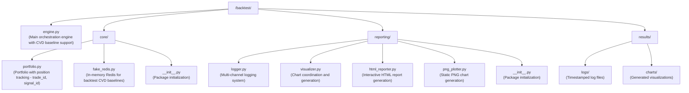
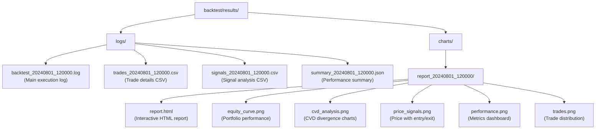

# SqueezeFlow Trader Backtest Engine Documentation

## Overview

The SqueezeFlow Trader backtest engine is a sophisticated orchestration system that coordinates trading strategy execution with comprehensive logging, visualization, and CVD baseline tracking. The engine implements **rolling window processing** to eliminate lookahead bias and match live trading behavior exactly. The engine implements clean separation of concerns, delegating all trading decisions to the strategy while managing execution, portfolio tracking, CVD baselines, and result analysis.

### Key Innovation: Rolling Window Processing

The backtest engine processes historical data using **rolling windows** with adaptive step sizes:

**1-Second Mode** (when using 1s timeframe data):
- **1-hour rolling windows** stepping forward **1 second** at a time
- **Full granularity testing**: Every second of data is evaluated
- **60x more decision points**: Matches real-time 1s execution

**Regular Mode** (5m+ timeframes):
- **4-hour rolling windows** stepping forward **5 minutes** at a time
- **Efficient processing**: Balanced between accuracy and speed

Both modes ensure:
- **No lookahead bias**: Strategy only sees data available up to the current time
- **Realistic reset detection**: Phase 3 reset patterns develop naturally over time
- **Live trading parity**: Processing matches production environment exactly
- **Proper convergence detection**: Market exhaustion patterns identified correctly

## Architecture

### Core Components



### Integration Points

The backtest engine integrates seamlessly with the production system:

#### Data Pipeline Integration
- **Market Data**: Uses `data/pipeline.py` for complete dataset loading
- **Symbol Discovery**: Dynamic symbol detection via `data/loaders/symbol_discovery.py`
- **Market Classification**: Exchange mapping via `data/processors/exchange_mapper.py`
- **CVD Calculation**: Industry-standard cumulative volume delta

#### Strategy Integration
- **Modular Strategies**: `/strategies/squeezeflow/` with 5-phase methodology
- **CVD Baseline Manager**: `strategies/squeezeflow/baseline_manager.py` for position tracking
- **Configuration**: `strategies/squeezeflow/config.py` for scoring weights

#### Position Tracking Integration
- **Trade IDs**: Automatic generation for backtest positions
- **Signal IDs**: Correlation between signals and trades
- **CVD Baselines**: Stored at position entry for Phase 5 exits

## Enhanced Execution Flow with Rolling Windows

### 1. Initialization Phase
```python
# Create engine with CVD baseline support and rolling window processing
engine = BacktestEngine(initial_balance=10000, leverage=1.0)

# Engine automatically initializes:
# - FakeRedis for CVD baseline storage
# - CVDBaselineManager for position tracking
# - Portfolio with enhanced position fields
# - Multi-channel logging system
# - Rolling window processor:
#   - 1s mode: 1-hour windows, 1-second steps
#   - Regular: 4-hour windows, 5-minute steps
```

### 2. Data Loading Phase
```python
# Load complete dataset through pipeline (full historical range)
dataset = data_pipeline.get_complete_dataset(
    symbol="BTCUSDT",           # Trading pair
    start_time=start,           # Start timestamp
    end_time=end,              # End timestamp
    timeframe="5m"             # Primary timeframe
)

# Dataset includes:
# - OHLCV data from multiple exchanges
# - Pre-calculated spot CVD (cumulative)
# - Pre-calculated futures CVD (cumulative)
# - Market metadata (exchanges, coverage)
# - Data quality metrics
```

### 2a. Rolling Window Processing
```python
# Rolling window implementation (adaptive)
if timeframe == '1s':
    window_size = timedelta(hours=1)    # 1-hour window for 1s mode
    step_size = timedelta(seconds=1)    # 1-second steps (full granularity)
else:
    window_size = timedelta(hours=4)    # 4-hour analysis window
    step_size = timedelta(minutes=5)    # 5-minute forward steps

current_time = start_time + window_size
while current_time <= end_time:
    # Create windowed dataset (time-sliced to current_time)
    windowed_data = create_windowed_dataset(
        dataset, 
        window_start=current_time - window_size,
        window_end=current_time
    )
    
    # Process with strategy (no future data visibility)
    strategy_result = strategy.process(windowed_data, portfolio_state)
    
    # Execute generated orders
    executed_orders = execute_orders(strategy_result['orders'])
    
    # Step forward 5 minutes
    current_time += step_size
```

### 3. Strategy Processing Phase
```python
# Strategy receives dataset and portfolio state
strategy_result = strategy.process(dataset, portfolio_state)

# Strategy can access:
# - CVDBaselineManager via set_cvd_baseline_manager()
# - Leverage settings via set_leverage()
# - Complete market data with CVD
# - Current portfolio positions

# Strategy returns:
# - Orders with CVD values for baseline storage
# - Signal metadata for tracking
# - Debug information for logging
```

### 4. Order Execution with CVD Baseline Storage
```python
# For each order from strategy:
order = {
    'symbol': 'BTCUSDT',
    'side': 'BUY',
    'quantity': 0.001,
    'price': 50000,
    'spot_cvd': 1234567,      # Current spot CVD
    'futures_cvd': 2345678,   # Current futures CVD
    'signal_id': 'sig_123',   # Signal identifier
    'leverage': 3             # Position leverage
}

# Engine executes order:
# 1. Generates trade_id
# 2. Stores CVD baseline in FakeRedis
# 3. Opens position with tracking info
# 4. Links signal_id to trade_id
```

### 5. CVD Baseline Tracking
```python
# CVDBaselineManager stores at entry:
baseline = {
    'signal_id': 'sig_123',
    'trade_id': 1,
    'symbol': 'BTCUSDT',
    'side': 'buy',
    'entry_price': 50000,
    'spot_cvd': 1234567,
    'futures_cvd': 2345678,
    'timestamp': '2024-08-01T12:00:00Z'
}

# Phase 5 exits can retrieve baseline:
baseline = cvd_baseline_manager.get_baseline_by_trade(trade_id=1)
flow_change = current_cvd - baseline['spot_cvd']
```

### 6. Result Generation
```python
# Comprehensive results include:
result = {
    'symbol': 'BTCUSDT',
    'initial_balance': 10000,
    'final_balance': 12500,
    'total_return': 25.0,
    'total_trades': 45,
    'win_rate': 62.2,
    'executed_orders': [...],      # All executed orders
    'portfolio_state': {...},      # Final portfolio state
    'cvd_baselines': {...},        # All CVD baselines
    'visualization_path': '...'    # Generated reports
}
```

## Multi-Channel Logging System

### Logging Structure


### Logging Channels

#### 1. Main Application Log
- Strategy decisions and reasoning
- CVD calculations and divergence
- Signal generation with scores
- Order execution details
- Performance metrics

#### 2. Trade CSV Log
```csv
timestamp,symbol,side,quantity,price,leverage,pnl,total_value,trade_id,signal_id
2024-08-01 12:00:00,BTCUSDT,BUY,0.001,50000,3,0,10000,1,sig_123
2024-08-01 13:00:00,BTCUSDT,SELL,0.001,51000,3,50,10050,1,sig_123
```

#### 3. Signal CSV Log
```csv
timestamp,symbol,signal_type,score,spot_cvd,futures_cvd,divergence,action
2024-08-01 12:00:00,BTCUSDT,LONG_SQUEEZE,7.5,1234567,2345678,-1111111,ENTRY
2024-08-01 13:00:00,BTCUSDT,FLOW_EXIT,N/A,1345678,2456789,-1111111,EXIT
```

## Visualization System

### Generated Reports

#### 1. HTML Interactive Report
- Complete trade history table
- Sortable and filterable data
- Performance metrics dashboard
- Strategy configuration display
- Session metadata

#### 2. PNG Chart Suite
- **Equity Curve**: Portfolio value over time with drawdown
- **CVD Analysis**: Spot vs Futures CVD with divergence
- **Price Signals**: Entry/exit points on price chart
- **Performance Dashboard**: Key metrics visualization
- **Trade Distribution**: Win/loss analysis

### Visualization Features
- Multi-panel synchronized charts
- Annotated entry/exit points
- CVD divergence highlighting
- Performance metric overlays
- Professional styling with grid

## Rolling Window Benefits

### Eliminates Lookahead Bias
**Problem Solved**: Previous full-dataset processing allowed strategies to "see" future data, creating unrealistic results.

**Solution**: Rolling windows ensure strategy only processes data available up to the current timestamp:
```python
# OLD: Strategy could access entire dataset
strategy.process(full_dataset)  # Has future data visibility

# NEW: Strategy only sees windowed data  
strategy.process(windowed_data)  # Limited to current_time and before
```

### Fixes Reset Detection
**Problem Solved**: Phase 3 reset detection failed because convergence patterns weren't developing naturally.

**Solution**: Sequential processing allows reset patterns to emerge over time:
- CVD convergence exhaustion develops gradually
- Market structure changes become visible step-by-step  
- Reset Type A and B patterns detected correctly
- Entry timing becomes more precise

### Matches Live Trading Behavior
**Identical Processing**: Rolling window backtests now process data exactly like live trading:
- Same 4-hour context windows
- Same 5-minute processing intervals
- Same data visibility constraints
- Same strategy decision-making flow

### Performance Characteristics
```yaml
Processing Volume:

**1-Second Mode**:
  - 1-day backtest: ~86,400 rolling windows (24h × 3600s)
  - 1-hour backtest: ~3,600 rolling windows
  - Progress logging: Every 1000 iterations

**Regular Mode**:
  - 1-day backtest: ~288 rolling windows (24h × 60min ÷ 5min)
  - 1-week backtest: ~2016 rolling windows
  - Progress logging: Every 100 iterations

Execution Speed:
  - Window processing: <50ms per window
  - 1-day backtest: 1-2 seconds total
  - Scales linearly with date range
  - Memory efficient: One window at a time

Resource Usage:
  - Memory: 200-500 MB (same as before)
  - CPU: Single-core processing
  - Disk: No change in output size
```

## Performance Optimization

### Memory Management
- Rolling window processing for large datasets (eliminates full dataset loading)
- Efficient pandas operations with copy control
- Garbage collection after each window
- Limited chart data points for visualization
- Time-sliced data reduces memory footprint

### Execution Speed
- Vectorized CVD calculations within windows
- Batch order processing across windows
- Optimized portfolio updates
- Parallel visualization generation
- Sequential processing eliminates resampling overhead

### Data Efficiency
- Window-based data access patterns
- Selective column loading per window
- Index-based time slicing operations
- Memory-mapped file options for large datasets

## Configuration

### Engine Configuration
```python
# Initialize with custom settings
engine = BacktestEngine(
    initial_balance=10000,      # Starting capital
    leverage=3.0                # Maximum leverage
)

# Run with parameters
result = engine.run(
    strategy=SqueezeFlowStrategy(),
    symbol='BTCUSDT',
    start_date='2024-08-01',
    end_date='2024-08-04',
    timeframe='5m',
    balance=10000,              # Override initial balance
    leverage=3.0                # Override leverage
)
```

### Strategy Configuration
```python
# Strategy receives configuration
class SqueezeFlowStrategy:
    def __init__(self):
        self.config = SqueezeFlowConfig()
        self.cvd_baseline_manager = None
        
    def set_cvd_baseline_manager(self, manager):
        self.cvd_baseline_manager = manager
        
    def set_leverage(self, leverage):
        self.leverage = leverage
```

## Usage Examples

### Basic Backtest
```bash
# Run from command line
python backtest/engine.py --symbol BTCUSDT --start-date 2024-08-01 --end-date 2024-08-04

# Or import and use
from backtest.engine import BacktestEngine
from strategies.squeezeflow.strategy import SqueezeFlowStrategy

engine = BacktestEngine()
result = engine.run(
    strategy=SqueezeFlowStrategy(),
    symbol='BTCUSDT',
    start_date='2024-08-01',
    end_date='2024-08-04'
)
```

### Advanced Usage with CVD Baselines
```python
# Strategy with CVD baseline tracking
strategy = SqueezeFlowStrategy()
engine = BacktestEngine(initial_balance=50000, leverage=5)

# Engine automatically sets up CVD baseline manager
result = engine.run(strategy, 'BTCUSDT', '2024-08-01', '2024-08-04')

# Access CVD baselines from results
for trade_id, baseline in result.get('cvd_baselines', {}).items():
    print(f"Trade {trade_id}: Entry CVD = {baseline['spot_cvd']}")
```

### Custom Strategy Integration
```python
from strategies.base import BaseStrategy

class CustomStrategy(BaseStrategy):
    def process(self, dataset, portfolio_state):
        # Access CVD baseline manager if available
        if self.cvd_baseline_manager:
            # Use for exit decisions
            for position in portfolio_state['positions']:
                baseline = self.cvd_baseline_manager.get_baseline_by_trade(
                    position['trade_id']
                )
                # Calculate flow change since entry
                
        # Return orders with CVD values
        return {
            'orders': [{
                'symbol': dataset['symbol'],
                'side': 'BUY',
                'quantity': 0.001,
                'price': current_price,
                'spot_cvd': dataset['spot_cvd'].iloc[-1],
                'futures_cvd': dataset['futures_cvd'].iloc[-1]
            }]
        }
```

## Integration with Live Trading

The rolling window backtest engine now provides **exact parity** with live trading:

### Identical Components
- **Strategy**: `/strategies/squeezeflow/` (identical code, zero changes needed)
- **CVD Calculation**: Same industry-standard methodology and timing
- **Scoring System**: Identical 10-point scoring with same data visibility
- **Risk Management**: Same position sizing logic
- **Data Processing**: Same 4-hour windows, 5-minute intervals
- **Reset Detection**: Same sequential pattern recognition
- **Context Assessment**: Same multi-timeframe analysis approach

### Minimal Differences from Live
| Component | Rolling Window Backtest | Live Trading |
|-----------|------------------------|--------------|
| Data Source | Historical from InfluxDB | Real-time from InfluxDB |
| CVD Storage | FakeRedis (in-memory) | Redis (persistent) |
| Execution | Simulated with fees | FreqTrade API |
| Latency | None (instant) | Network latency (~100ms) |
| Slippage | Configurable simulation | Market reality |
| Processing (1s) | **1-hour windows, 1-sec steps** | **1-sec execution cycles** |
| Processing (5m+) | **4-hour windows, 5-min steps** | **5-min execution cycles** |

### Backtest-Live Parity Achieved
**Before Rolling Windows**: Significant differences in data processing led to strategy behavior differences between backtest and live trading.

**After Rolling Windows**: Strategy sees identical data patterns and timing in both environments:
```python
# Both backtest and live trading now process data identically:
windowed_data = get_data_window(current_time - 4h, current_time)
strategy_result = strategy.process(windowed_data)
```

This ensures backtest results are highly predictive of live trading performance.

## Troubleshooting

### Common Issues

#### 1. No Data Found
```python
# Check data availability
from data.loaders.symbol_discovery import SymbolDiscovery
discovery = SymbolDiscovery()
symbols = discovery.discover_symbols_from_database()
print(f"Available symbols: {symbols}")
```

#### 2. CVD Baseline Not Available
```python
# Ensure strategy has CVD baseline manager
if not strategy.cvd_baseline_manager:
    print("Warning: CVD baseline manager not set")
# Engine sets this automatically
```

#### 3. Memory Issues with Large Datasets
```python
# Use shorter time ranges or resample
result = engine.run(
    strategy=strategy,
    symbol='BTCUSDT',
    start_date='2024-08-01',
    end_date='2024-08-02',  # Shorter range
    timeframe='15m'          # Larger timeframe
)
```

## Performance Metrics

### Backtest Speed
- **Data Loading**: ~2-5 seconds for 1 week of 5m data
- **Strategy Processing**: ~1-3 seconds per 1000 candles
- **Visualization**: ~3-5 seconds for full report
- **Total Time**: ~10-15 seconds for typical backtest

### Resource Usage
- **Memory**: 200-500 MB for 1 week backtest
- **CPU**: Single-core for strategy, multi-core for visualization
- **Disk**: ~5-10 MB per backtest (logs + charts)

## Best Practices

### 1. Strategy Development
- Use logging extensively for debugging
- Store CVD values in orders for baseline tracking
- Include signal_id for signal-to-trade correlation
- Test with different market conditions

### 2. Performance Testing
- Run backtests over different time periods
- Test with varying initial balances
- Experiment with leverage settings
- Validate against live trading results

### 3. Result Analysis
- Review HTML reports for trade details
- Analyze CVD charts for strategy behavior
- Check signal CSV for pattern recognition
- Monitor equity curve for drawdowns

## Related Documentation

- [Signal Generation Workflow](/docs/signal_generation_workflow.md) - Live trading pipeline
- [CVD Baseline Tracking](/docs/cvd_baseline_tracking.md) - Baseline system details
- [SqueezeFlow Strategy](/docs/squeezeflow_strategy.md) - Trading methodology
- [Services Architecture](/docs/services_architecture.md) - System components

---

*Last Updated: August 2025 - Enhanced with CVD baseline tracking and complete integration*