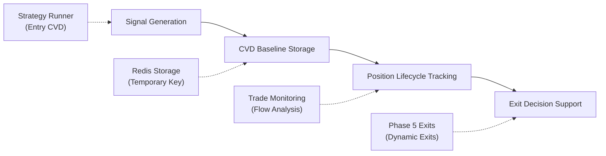

# CVD Baseline Tracking System

## Overview

The CVD Baseline Tracking System is a critical component of the SqueezeFlow Trader that enables intelligent position exit decisions by monitoring changes in Cumulative Volume Delta (CVD) flow from the moment a position is opened. This system implements Phase 5 of the SqueezeFlow methodology - Flow-Following Exits.

## System Architecture



## Core Components

### 1. CVD Baseline Manager

**Location:** `/strategies/squeezeflow/baseline_manager.py`  
**Purpose:** Manages CVD baseline storage and retrieval for position lifecycle tracking  
**Storage:** Redis with 7-day TTL for active positions  

#### 1.1 CVD Baseline Data Structure
```python
@dataclass
class CVDBaseline:
    """CVD baseline data stored when position opens"""
    symbol: str                  # Trading symbol (e.g., 'BTC')
    trade_id: int               # FreqTrade trade ID
    signal_id: str              # Original signal ID
    entry_time: datetime        # Position entry timestamp
    spot_cvd: float             # Spot CVD at entry
    futures_cvd: float          # Futures CVD at entry
    cvd_divergence: float       # CVD divergence at entry (futures - spot)
    entry_price: float          # Entry price
    side: str                   # Position side ('long' or 'short')
```

#### 1.2 Baseline Storage Workflow
```python
def store_baseline(self, signal_id: str, trade_id: int, symbol: str, side: str,
                  entry_price: float, spot_cvd: float, futures_cvd: float) -> bool:
    """Store CVD baseline when position opens"""
    
    # Calculate CVD divergence
    cvd_divergence = futures_cvd - spot_cvd
    
    # Create baseline object
    baseline = CVDBaseline(
        symbol=symbol,
        trade_id=trade_id,
        signal_id=signal_id,
        entry_time=datetime.now(),
        spot_cvd=spot_cvd,
        futures_cvd=futures_cvd,
        cvd_divergence=cvd_divergence,
        entry_price=entry_price,
        side=side
    )
    
    # Store in Redis with 7-day TTL
    baseline_key = f"squeezeflow:cvd_baselines:trade:{trade_id}"
    baseline_data = json.dumps(baseline.to_dict(), default=str)
    
    success = self.redis_client.setex(
        baseline_key, 
        timedelta(days=7).total_seconds(),
        baseline_data
    )
```

### 2. Signal-to-Trade Linking Process

#### 2.1 Temporary Signal Storage
When a signal is generated by the Strategy Runner, CVD baseline data is temporarily stored with the signal ID as the key:

```python
async def _store_cvd_baseline_for_signal(self, signal: Dict, dataset: Dict):
    """Store CVD baseline data when signal is published"""
    
    # Get current CVD values from dataset
    spot_cvd_series = dataset.get('spot_cvd')
    futures_cvd_series = dataset.get('futures_cvd')
    
    current_spot_cvd = float(spot_cvd_series.iloc[-1])
    current_futures_cvd = float(futures_cvd_series.iloc[-1])
    
    # Store baseline temporarily with signal_id until we get trade_id
    baseline_key = f"signal_cvd:{signal['signal_id']}"
    baseline_data = {
        'signal_id': signal['signal_id'],
        'symbol': signal['base_symbol'],
        'side': signal['action'].lower(),
        'entry_price': signal['entry_price'],
        'spot_cvd': current_spot_cvd,
        'futures_cvd': current_futures_cvd,
        'cvd_divergence': current_futures_cvd - current_spot_cvd,
        'timestamp': signal['timestamp']
    }
    
    # Store with 24-hour TTL (extended to allow time for trade execution)
    self.redis_client.setex(
        baseline_key, 
        86400,  # 24 hours
        json.dumps(baseline_data, default=str)
    )
```

#### 2.2 Trade Execution Linking
When FreqTrade executes a trade based on a signal, the temporary baseline data is moved to permanent storage:

```python
def link_signal_to_trade(self, signal_id: str, trade_id: int) -> bool:
    """Link signal to FreqTrade trade and move CVD baseline to permanent storage"""
    
    # Get temporary baseline data
    baseline_key = f"signal_cvd:{signal_id}"
    baseline_data_str = self.redis_client.get(baseline_key)
    
    if not baseline_data_str:
        return False
    
    baseline_data = json.loads(baseline_data_str)
    
    # Store in permanent CVD baseline manager
    success = self.cvd_baseline_manager.store_baseline(
        signal_id=signal_id,
        trade_id=trade_id,
        symbol=baseline_data['symbol'],
        side=baseline_data['side'],
        entry_price=baseline_data['entry_price'],
        spot_cvd=baseline_data['spot_cvd'],
        futures_cvd=baseline_data['futures_cvd']
    )
    
    if success:
        # Remove temporary data
        self.redis_client.delete(baseline_key)
        
    return success
```

### 3. CVD Flow Analysis Engine

#### 3.1 Flow Change Calculation
```python
def calculate_cvd_flow_change(self, trade_id: int, current_spot_cvd: float, 
                             current_futures_cvd: float) -> Optional[Dict[str, float]]:
    """Calculate CVD flow change since position entry"""
    
    baseline = self.get_baseline(trade_id)
    if not baseline:
        return None
    
    # Calculate absolute changes
    spot_change = current_spot_cvd - baseline.spot_cvd
    futures_change = current_futures_cvd - baseline.futures_cvd
    
    # Calculate divergence changes
    current_divergence = current_futures_cvd - current_spot_cvd
    divergence_change = current_divergence - baseline.cvd_divergence
    
    # Calculate time metrics
    time_since_entry_hours = (datetime.now() - baseline.entry_time).total_seconds() / 3600
    
    flow_metrics = {
        'spot_cvd_change': spot_change,
        'futures_cvd_change': futures_change,
        'divergence_change': divergence_change,
        'current_divergence': current_divergence,
        'baseline_divergence': baseline.cvd_divergence,
        'time_since_entry_hours': time_since_entry_hours,
        'flow_direction_maintained': self._is_flow_direction_maintained(baseline.side, divergence_change)
    }
    
    return flow_metrics
```

#### 3.2 Flow Direction Analysis
```python
def _is_flow_direction_maintained(self, side: str, divergence_change: float) -> bool:
    """Check if CVD flow direction supports the position"""
    
    if side == 'long':
        # For long positions, we want increasing or stable divergence
        # (futures leading upward or maintaining leadership)
        return divergence_change >= -0.1  # Allow small negative changes
    else:  # short
        # For short positions, we want decreasing or stable divergence
        # (futures leading downward or maintaining leadership)
        return divergence_change <= 0.1   # Allow small positive changes
```

### 4. Integration with Strategy Runner

#### 4.1 Real-Time CVD Analysis
The Strategy Runner service provides real-time CVD analysis for open positions:

```python
def get_trade_cvd_analysis(self, trade_id: int) -> Optional[Dict[str, Any]]:
    """Get real-time CVD flow analysis for an open trade"""
    
    # Get baseline data
    baseline = self.cvd_baseline_manager.get_baseline(trade_id)
    if not baseline:
        return None
    
    # Get current CVD data for the symbol
    dataset = self.data_pipeline.get_complete_dataset(
        symbol=baseline.symbol,
        start_time=datetime.now() - timedelta(hours=1),
        end_time=datetime.now(),
        timeframe=self.config.default_timeframe
    )
    
    # Extract current CVD values
    spot_cvd_series = dataset.get('spot_cvd')
    futures_cvd_series = dataset.get('futures_cvd')
    
    current_spot_cvd = float(spot_cvd_series.iloc[-1])
    current_futures_cvd = float(futures_cvd_series.iloc[-1])
    
    # Calculate flow changes
    flow_metrics = self.cvd_baseline_manager.calculate_cvd_flow_change(
        trade_id, current_spot_cvd, current_futures_cvd
    )
    
    if flow_metrics:
        flow_metrics.update({
            'baseline_data': baseline.to_dict(),
            'current_spot_cvd': current_spot_cvd,
            'current_futures_cvd': current_futures_cvd,
            'timestamp': datetime.now().isoformat()
        })
    
    return flow_metrics
```

#### 4.2 CVD Integration with Strategy
The baseline manager is integrated with the SqueezeFlow strategy for Phase 5 exit decisions:

```python
def _setup_strategy_cvd_integration(self):
    """Setup CVD baseline manager integration with strategy"""
    
    cvd_manager = self.cvd_baseline_manager
    if cvd_manager and hasattr(self.strategy, 'set_cvd_baseline_manager'):
        self.strategy.set_cvd_baseline_manager(cvd_manager)
        self.logger.info("CVD baseline manager integrated with strategy")
```

## Phase 5 Exit Logic Integration

### 1. SqueezeFlow Strategy Integration
```python
class SqueezeFlowStrategy:
    """Main strategy with CVD baseline integration"""
    
    def set_cvd_baseline_manager(self, cvd_manager: CVDBaselineManager):
        """Set CVD baseline manager for Phase 5 exits"""
        self.cvd_baseline_manager = cvd_manager
        self.phase5_exits.set_cvd_manager(cvd_manager)
    
    def should_exit_position(self, trade_id: int, current_price: float) -> bool:
        """Phase 5 exit decision using CVD flow analysis"""
        
        if not self.cvd_baseline_manager:
            return False  # No CVD tracking available
        
        # Get current market data
        current_dataset = self._get_current_market_data()
        
        # Calculate CVD flow changes
        flow_analysis = self._analyze_cvd_flow_change(trade_id, current_dataset)
        
        if not flow_analysis:
            return False
        
        # Exit conditions based on CVD flow invalidation
        return self.phase5_exits.evaluate_exit_conditions(flow_analysis, current_price)
```

### 2. Phase 5 Exit Conditions
```python
class Phase5ExitManager:
    """Manages flow-following exit decisions"""
    
    def evaluate_exit_conditions(self, flow_analysis: Dict, current_price: float) -> bool:
        """Evaluate exit conditions based on CVD flow analysis"""
        
        # Exit condition 1: Flow direction reversal
        if not flow_analysis['flow_direction_maintained']:
            self.logger.info("Exit signal: CVD flow direction reversed")
            return True
        
        # Exit condition 2: Significant divergence deterioration
        divergence_change = flow_analysis['divergence_change']
        baseline_side = flow_analysis['baseline_data']['side']
        
        if baseline_side == 'long' and divergence_change < -1.0:
            self.logger.info("Exit signal: Long position divergence deteriorated significantly")
            return True
        elif baseline_side == 'short' and divergence_change > 1.0:
            self.logger.info("Exit signal: Short position divergence deteriorated significantly")
            return True
        
        # Exit condition 3: Time-based flow weakening
        time_hours = flow_analysis['time_since_entry_hours']
        if time_hours > 24 and abs(divergence_change) > 0.5:
            self.logger.info("Exit signal: Extended hold time with flow weakening")
            return True
        
        return False
```

## Redis Storage Architecture

### 1. Key Structure
```python
# Temporary signal-based storage (24-hour TTL)
"signal_cvd:{signal_id}"

# Permanent trade-based storage (7-day TTL)
"squeezeflow:cvd_baselines:trade:{trade_id}"

# Symbol index for quick lookups
"squeezeflow:cvd_baselines:symbol:{symbol}"
```

### 2. Data Persistence
```python
def _update_symbol_index(self, symbol: str, trade_id: int, baseline_key: str):
    """Update symbol index for efficient symbol-based queries"""
    
    symbol_index_key = f"squeezeflow:cvd_baselines:symbol:{symbol}"
    self.redis_client.sadd(symbol_index_key, trade_id)
    # Set expiration on index
    self.redis_client.expire(symbol_index_key, timedelta(days=7).total_seconds())
```

### 3. Cleanup and Maintenance
```python
def cleanup_expired_baselines(self) -> int:
    """Clean up expired baselines"""
    
    cleaned = 0
    pattern = f"squeezeflow:cvd_baselines:trade:*"
    
    # Scan for all baseline keys
    for key in self.redis_client.scan_iter(match=pattern):
        try:
            data = self.redis_client.get(key)
            if data:
                baseline_data = json.loads(data)
                entry_time = datetime.fromisoformat(baseline_data['entry_time'])
                
                # Remove baselines older than 7 days
                if datetime.now() - entry_time > timedelta(days=7):
                    trade_id = int(key.split(':')[-1])
                    if self.remove_baseline(trade_id):
                        cleaned += 1
                        
        except (ValueError, json.JSONDecodeError, KeyError):
            # Invalid data, remove it
            self.redis_client.delete(key)
            cleaned += 1
    
    return cleaned
```

## FakeRedis for Backtesting

### 1. Mock Implementation
```python
class FakeRedis:
    """Mock Redis implementation for backtesting CVD baseline tracking"""
    
    def __init__(self):
        self.data = {}
        self.expiry = {}
    
    def setex(self, key: str, ttl: int, value: str) -> bool:
        """Set key with expiration"""
        self.data[key] = value
        self.expiry[key] = datetime.now() + timedelta(seconds=ttl)
        return True
    
    def get(self, key: str) -> Optional[str]:
        """Get key value with expiration check"""
        if key in self.expiry and datetime.now() > self.expiry[key]:
            self.delete(key)
            return None
        return self.data.get(key)
    
    def delete(self, key: str) -> int:
        """Delete key"""
        deleted = 0
        if key in self.data:
            del self.data[key]
            deleted += 1
        if key in self.expiry:
            del self.expiry[key]
        return deleted
```

### 2. Backtest Integration
```python
class BacktestCVDBaselineManager(CVDBaselineManager):
    """CVD baseline manager for backtesting with FakeRedis"""
    
    def __init__(self, key_prefix: str = "squeezeflow"):
        fake_redis = FakeRedis()
        super().__init__(fake_redis, key_prefix)
        self.is_backtest = True
    
    def store_baseline_for_backtest(self, trade_data: Dict, cvd_data: Dict):
        """Store baseline specifically for backtest scenarios"""
        
        success = self.store_baseline(
            signal_id=trade_data['signal_id'],
            trade_id=trade_data['trade_id'],
            symbol=trade_data['symbol'],
            side=trade_data['side'],
            entry_price=trade_data['entry_price'],
            spot_cvd=cvd_data['spot_cvd'],
            futures_cvd=cvd_data['futures_cvd']
        )
        
        return success
```

## Performance Metrics

### 1. Baseline Manager Metrics
```python
def get_metrics(self) -> Dict[str, Any]:
    """Get CVD baseline manager performance metrics"""
    
    return {
        'baselines_stored': self.metrics['baselines_stored'],
        'baselines_retrieved': self.metrics['baselines_retrieved'],
        'baselines_deleted': self.metrics['baselines_deleted'],
        'storage_errors': self.metrics['storage_errors'],
        'retrieval_errors': self.metrics['retrieval_errors'],
        'total_active_baselines': len(list(self.redis_client.scan_iter(
            match=f"{self.baseline_key}:trade:*"
        ))),
        'average_baseline_age_hours': self._calculate_average_baseline_age(),
        'timestamp': datetime.now().isoformat()
    }
```

### 2. Flow Analysis Metrics
```python
def get_flow_analysis_metrics(self) -> Dict:
    """Get CVD flow analysis performance metrics"""
    
    return {
        'total_flow_analyses': self.flow_analysis_count,
        'successful_analyses': self.successful_flow_analyses,
        'flow_direction_maintained_count': self.flow_maintained_count,
        'flow_direction_reversed_count': self.flow_reversed_count,
        'average_analysis_time_ms': self.avg_analysis_time * 1000,
        'timestamp': datetime.now().isoformat()
    }
```

## API Integration Examples

### 1. REST API Endpoints
```python
# Get CVD flow analysis for active trade
GET /api/trades/{trade_id}/cvd-analysis

# Response:
{
    "trade_id": 123,
    "symbol": "BTC",
    "baseline_data": {
        "entry_time": "2025-08-06T10:00:00Z",
        "spot_cvd": 1000000.0,
        "futures_cvd": 1200000.0,
        "cvd_divergence": 200000.0,
        "side": "long"
    },
    "current_analysis": {
        "current_spot_cvd": 1150000.0,
        "current_futures_cvd": 1400000.0,
        "spot_cvd_change": 150000.0,
        "futures_cvd_change": 200000.0,
        "divergence_change": 50000.0,
        "flow_direction_maintained": true,
        "time_since_entry_hours": 2.5
    },
    "exit_recommendation": {
        "should_exit": false,
        "confidence": 0.85,
        "reasons": []
    }
}
```

### 2. WebSocket Real-Time Updates
```python
# CVD flow updates via WebSocket
{
    "type": "cvd_flow_update",
    "trade_id": 123,
    "timestamp": "2025-08-06T12:30:00Z",
    "flow_metrics": {
        "divergence_change": 45000.0,
        "flow_direction_maintained": true,
        "trend_strength": "strong"
    },
    "alerts": []
}
```

## Integration with FreqTrade

### 1. Webhook Integration
```python
# FreqTrade webhook for trade execution
@app.route('/webhook/trade-opened', methods=['POST'])
def handle_trade_opened():
    """Handle trade opened webhook from FreqTrade"""
    
    trade_data = request.json
    
    # Extract signal ID from trade metadata
    signal_id = trade_data.get('metadata', {}).get('signal_id')
    trade_id = trade_data['trade_id']
    
    if signal_id:
        # Link signal to trade and move CVD baseline to permanent storage
        success = strategy_runner.link_signal_to_trade(signal_id, trade_id)
        
        if success:
            logger.info(f"CVD baseline linked for trade {trade_id}")
        else:
            logger.warning(f"Failed to link CVD baseline for trade {trade_id}")
    
    return {'status': 'processed'}
```

### 2. Exit Signal Integration
```python
# Integration with FreqTrade exit signals
def populate_exit_trend(self, dataframe: pd.DataFrame, metadata: Dict) -> pd.DataFrame:
    """FreqTrade exit trend based on CVD flow analysis"""
    
    # Get active trade for this pair
    active_trade = self.get_active_trade(metadata['pair'])
    
    if active_trade:
        trade_id = active_trade['trade_id']
        
        # Get CVD flow analysis
        cvd_analysis = self.get_cvd_flow_analysis(trade_id)
        
        if cvd_analysis:
            # Check Phase 5 exit conditions
            should_exit = self.evaluate_cvd_exit_conditions(cvd_analysis)
            
            if should_exit:
                dataframe.loc[dataframe.index[-1], 'exit_long'] = 1
                dataframe.loc[dataframe.index[-1], 'exit_short'] = 1
    
    return dataframe
```

This comprehensive CVD baseline tracking system provides the foundation for intelligent, flow-following exit decisions that adapt to real-time market conditions rather than relying on fixed stop-losses or profit targets.