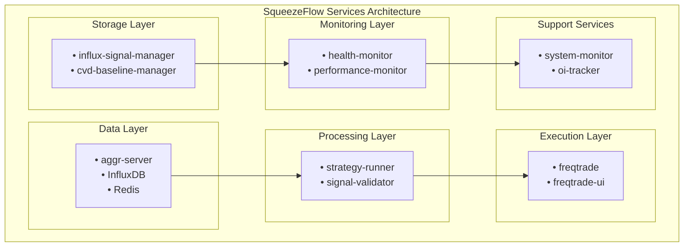
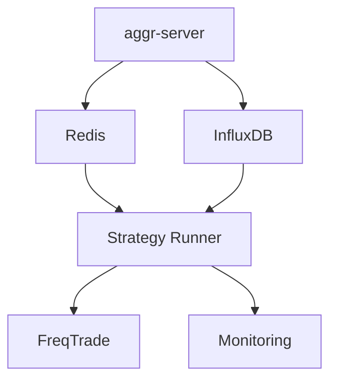

# SqueezeFlow Trader Services Architecture

## Overview

The SqueezeFlow Trader system is built on a microservices architecture with specialized services for each aspect of the trading pipeline. This document provides comprehensive documentation of all services, their responsibilities, APIs, and integration patterns.

## Service Topology



## Core Services

### 1. Strategy Runner Service

**Location:** `/services/strategy_runner.py`  
**Purpose:** Main signal generation service that executes the SqueezeFlow strategy on live market data  
**Status:** Production-ready, fully operational  

#### 1.1 Service Architecture
```python
class StrategyRunner:
    """Live trading service that runs SqueezeFlow strategy on real-time data"""
    
    def __init__(self, config_manager: Optional[ConfigManager] = None):
        # Initialize core components
        self.strategy = SqueezeFlowStrategy()
        self.data_pipeline = DataPipeline()
        self.cvd_calculator = CVDCalculator()
        
        # Initialize connections (lazy loading)
        self._redis_client = None
        self._influx_client = None
        self._signal_manager = None
        self._freqtrade_client = None
        self._cvd_baseline_manager = None
```

#### 1.2 Core Responsibilities
- **Real-time data processing**: Loads 48 hours of market data per cycle
- **CVD calculation**: Computes cumulative volume delta in real-time
- **Strategy execution**: Runs complete 5-phase SqueezeFlow methodology
- **Signal generation**: Creates scored signals with position sizing
- **Validation**: Comprehensive signal validation and deduplication
- **Publishing**: Redis signal publishing with batch optimization
- **Baseline tracking**: CVD baseline storage for position lifecycle management

#### 1.3 Service Configuration
```python
@dataclass
class ServiceConfig:
    run_interval_seconds: int = 1           # Strategy execution cycle
    max_symbols_per_cycle: int = 10         # Concurrent symbol processing
    data_lookback_hours: int = 48           # Historical data window
    default_timeframe: str = "5m"           # Primary analysis timeframe
    max_concurrent_signals: int = 5         # Risk management limit
    signal_cooldown_minutes: int = 15       # Symbol-specific cooldown
```

#### 1.4 Execution Cycle
```python
async def _run_strategy_cycle(self, symbols: List[str]):
    """1-second execution cycle"""
    
    for symbol in symbols:
        # 1. Load real-time data (48h window)
        dataset = await self._load_symbol_data(symbol)
        
        # 2. Validate data quality
        if not self._validate_dataset(dataset):
            continue
        
        # 3. Get portfolio state from FreqTrade
        portfolio_state = await self._get_portfolio_state()
        
        # 4. Execute strategy
        strategy_result = self.strategy.process(dataset, portfolio_state)
        
        # 5. Convert orders to signals
        orders = strategy_result.get('orders', [])
        if orders:
            await self._convert_orders_to_signals(symbol, orders, strategy_result, dataset)
```

#### 1.5 Performance Metrics
```python
performance_stats = {
    'cycles_completed': 0,
    'signals_generated': 0,
    'signals_published': 0,
    'signals_failed': 0,
    'signals_duplicate': 0,
    'signals_rate_limited': 0,
    'batch_published': 0,
    'errors_encountered': 0,
    'last_cycle_duration': 0.0,
    'avg_cycle_duration': 0.0,
    'redis_publish_time': 0.0,
    'validation_time': 0.0
}
```

### 2. InfluxDB Signal Manager

**Location:** `/services/influx_signal_manager.py`  
**Purpose:** Enhanced signal storage, analytics, and monitoring capabilities  
**Features:** Performance tracking, query optimization, signal outcome monitoring  

#### 2.1 Enhanced Signal Storage
```python
class InfluxSignalManager:
    """Enhanced InfluxDB Signal Manager with comprehensive analytics"""
    
    def store_enhanced_signal(self, signal: Dict) -> bool:
        """Store signal with enhanced tracking capabilities"""
        
        point = {
            'measurement': 'strategy_signals',
            'tags': {
                'symbol': signal['symbol'],
                'action': signal['action'],
                'strategy': signal.get('strategy', 'SqueezeFlowStrategy'),
                'service': signal.get('service', 'strategy_runner'),
                'score_tier': self._get_score_tier(signal.get('score', 0)),
                'confidence_tier': self._get_confidence_tier(signal.get('confidence', 0))
            },
            'fields': {
                'signal_id': signal['signal_id'],
                'score': float(signal.get('score', 0)),
                'position_size_factor': float(signal.get('position_size_factor', 1.0)),
                'leverage': int(signal.get('leverage', 1)),
                'entry_price': float(signal.get('entry_price', 0)),
                'confidence': float(signal.get('confidence', 0)),
                'outcome': SignalOutcome.PENDING.value,
                'tracking_id': str(uuid.uuid4())[:8]
            }
        }
```

#### 2.2 Signal Analytics
```python
def get_signal_analytics(self, symbol: str = None, hours_back: int = 24) -> SignalAnalytics:
    """Comprehensive signal performance analytics"""
    
    query = f'''
        SELECT 
            COUNT(*) as total_signals,
            COUNT(CASE WHEN outcome = 'profitable' THEN 1 END) as profitable,
            COUNT(CASE WHEN outcome = 'unprofitable' THEN 1 END) as unprofitable,
            MEAN(score) as avg_score,
            MEAN(pnl) as avg_pnl,
            SUM(pnl) as total_pnl,
            MAX(pnl) as max_profit,
            MIN(pnl) as max_loss
        FROM strategy_signals 
        WHERE time >= now() - {hours_back}h
    '''
```

#### 2.3 Signal Outcome Tracking
```python
class SignalOutcome(Enum):
    PENDING = "pending"
    PROFITABLE = "profitable" 
    UNPROFITABLE = "unprofitable"
    EXPIRED = "expired"
    CANCELLED = "cancelled"

def update_signal_outcome(self, signal_id: str, outcome: SignalOutcome, 
                         exit_price: float = None, pnl: float = None) -> bool:
    """Update signal outcome after trade completion"""
```

#### 2.4 Performance by Score Tier
```python
def get_signal_performance_by_score(self, hours_back: int = 168) -> Dict:
    """Signal performance breakdown by score tiers"""
    
    # Score tiers: high (8+), medium (6-7.9), low (4-5.9), very_low (<4)
    query = f'''
        SELECT 
            score_tier,
            COUNT(*) as total_signals,
            COUNT(CASE WHEN outcome = 'profitable' THEN 1 END) as profitable,
            MEAN(pnl) as avg_pnl,
            MEAN(holding_time_minutes) as avg_holding_time
        FROM strategy_signals 
        WHERE time >= now() - {hours_back}h 
        GROUP BY score_tier
    '''
```

### 3. Signal Validator Service

**Location:** `/services/signal_validator.py`  
**Purpose:** Comprehensive signal validation, deduplication, and rate limiting  
**Features:** Multi-level validation, batch processing, performance monitoring  

#### 3.1 Validation Architecture
```python
class SignalValidator:
    """Comprehensive signal validation and deduplication"""
    
    def __init__(self, config):
        self.config = {
            'max_signals_per_minute': 20,
            'max_signals_per_symbol_per_hour': 10,
            'signal_cooldown_minutes': 15,
            'cleanup_interval_hours': 12
        }
        
        # Tracking structures
        self._signal_history = defaultdict(list)
        self._symbol_last_signal = {}
        self._rate_limit_tracker = defaultdict(list)
```

#### 3.2 Validation Levels
```python
class ValidationResult(Enum):
    VALID = "valid"
    DUPLICATE = "duplicate"
    RATE_LIMITED = "rate_limited"
    COOLDOWN_ACTIVE = "cooldown_active"
    INVALID_FORMAT = "invalid_format"
    EXPIRED = "expired"

def validate_signal(self, signal: Dict) -> Tuple[ValidationResult, List[ValidationError]]:
    """Multi-level signal validation"""
    
    errors = []
    
    # 1. Format validation
    if not self._validate_signal_format(signal):
        errors.append(ValidationError("INVALID_FORMAT", "Signal format is invalid"))
    
    # 2. Duplicate detection
    if self._is_duplicate_signal(signal):
        return ValidationResult.DUPLICATE, [ValidationError("DUPLICATE", "Duplicate signal detected")]
    
    # 3. Rate limiting
    if self._is_rate_limited(signal):
        return ValidationResult.RATE_LIMITED, [ValidationError("RATE_LIMITED", "Rate limit exceeded")]
    
    # 4. Cooldown check
    if self._is_symbol_in_cooldown(signal['symbol']):
        return ValidationResult.COOLDOWN_ACTIVE, [ValidationError("COOLDOWN", f"Symbol in {self.config['signal_cooldown_minutes']}min cooldown")]
    
    return ValidationResult.VALID, errors
```

#### 3.3 Batch Validation
```python
class BatchSignalValidator:
    """Efficient batch signal validation"""
    
    def validate_batch(self, signals: List[Dict]) -> Dict:
        """Validate multiple signals efficiently"""
        
        valid_signals = []
        invalid_signals = []
        
        for signal in signals:
            result, errors = self.validator.validate_signal(signal)
            
            if result == ValidationResult.VALID:
                valid_signals.append(signal)
            else:
                invalid_signals.append({
                    'signal': signal,
                    'result': result.value,
                    'errors': errors
                })
        
        return {
            'valid_signals': valid_signals,
            'invalid_signals': invalid_signals,
            'batch_stats': {
                'total_processed': len(signals),
                'valid_count': len(valid_signals),
                'invalid_count': len(invalid_signals),
                'duplicate_count': sum(1 for inv in invalid_signals if inv['result'] == 'duplicate'),
                'rate_limited_count': sum(1 for inv in invalid_signals if inv['result'] == 'rate_limited')
            }
        }
```

### 4. Optimized Redis Client

**Location:** `/services/optimized_redis_client.py`  
**Purpose:** High-performance Redis operations with connection pooling and batch processing  
**Features:** Connection pooling, pipeline operations, pub/sub management  

#### 4.1 Connection Pool Architecture
```python
class OptimizedRedisClient:
    """High-performance Redis client with advanced features"""
    
    def __init__(self, config: Dict):
        # Connection pool for main operations
        self.main_pool = redis.ConnectionPool(
            host=config['host'],
            port=config['port'],
            db=config['db'],
            max_connections=20,
            socket_keepalive=True,
            socket_keepalive_options={},
            decode_responses=True
        )
        
        # Separate connection for pub/sub
        self.pubsub_pool = redis.ConnectionPool(
            host=config['host'],
            port=config['port'],
            db=config['db'],
            max_connections=5
        )
        
        self.main_client = redis.Redis(connection_pool=self.main_pool)
        self.pubsub_client = redis.Redis(connection_pool=self.pubsub_pool)
```

#### 4.2 Batch Operations
```python
def batch_publish_signals(self, signals: List[Dict], ttl: int = 600) -> Dict:
    """Efficient batch signal publishing with pipeline"""
    
    pipe = self.main_client.pipeline()
    published_count = 0
    
    for signal in signals:
        key = f"squeezeflow:signal:{signal['symbol']}"
        channel = "squeezeflow:signals"
        signal_json = json.dumps(signal, default=str)
        
        # Add operations to pipeline
        pipe.setex(key, ttl, signal_json)
        pipe.publish(channel, signal_json)
        
        # History management
        history_key = f"squeezeflow:history:{signal['symbol']}"
        pipe.lpush(history_key, signal_json)
        pipe.ltrim(history_key, 0, 99)
        pipe.expire(history_key, 86400)
    
    # Execute all operations atomically
    results = pipe.execute()
    published_count = len(signals)
    
    return {
        'published_count': published_count,
        'success': True,
        'publish_time': time.time() - start_time
    }
```

#### 4.3 Pub/Sub Management
```python
def subscribe_to_channels(self, channels: List[str], callback) -> str:
    """Subscribe to multiple Redis channels with callback"""
    
    subscriber_id = f"sub_{uuid.uuid4().hex[:8]}"
    pubsub = self.pubsub_client.pubsub()
    
    for channel in channels:
        pubsub.subscribe(channel)
    
    # Start background listener
    def listener():
        try:
            for message in pubsub.listen():
                if message['type'] == 'message':
                    try:
                        data = json.loads(message['data'])
                        callback(message['channel'], data)
                    except Exception as e:
                        logging.error(f"Callback error: {e}")
        except Exception as e:
            logging.error(f"Pub/sub listener error: {e}")
    
    thread = threading.Thread(target=listener, daemon=True)
    thread.start()
    
    return subscriber_id
```

### 5. FreqTrade Client

**Location:** `/services/freqtrade_client.py`  
**Purpose:** FreqTrade API integration for portfolio management and trade execution monitoring  
**Features:** API client, portfolio state retrieval, trade outcome tracking  

#### 5.1 API Client Architecture
```python
class FreqTradeAPIClient:
    """FreqTrade API client for portfolio management"""
    
    def __init__(self, config: Dict):
        self.api_url = config['api_url']
        self.username = config['username']
        self.password = config['password']
        self.timeout = config['timeout']
        self.session = requests.Session()
        
        # Authentication
        self._authenticate()
```

#### 5.2 Portfolio State Management
```python
def get_portfolio_state(self) -> Dict[str, Any]:
    """Get current portfolio state from FreqTrade"""
    
    try:
        # Get account balance
        balance_response = self._make_request('GET', '/api/v1/balance')
        
        # Get open trades
        trades_response = self._make_request('GET', '/api/v1/trades')
        
        # Get performance stats
        profit_response = self._make_request('GET', '/api/v1/profit')
        
        return {
            'positions': self._parse_open_positions(trades_response),
            'total_value': balance_response.get('total', 0),
            'available_balance': balance_response.get('free', 0),
            'total_profit': profit_response.get('profit_all_coin', 0),
            'open_trade_count': len(trades_response.get('trades', [])),
            'timestamp': datetime.now().isoformat()
        }
        
    except Exception as e:
        logging.error(f"Error getting portfolio state: {e}")
        return None
```

#### 5.3 Trade Outcome Tracking
```python
def get_trade_outcomes(self, since: datetime = None) -> List[Dict]:
    """Get completed trades for signal outcome tracking"""
    
    params = {}
    if since:
        params['since'] = int(since.timestamp())
    
    response = self._make_request('GET', '/api/v1/trades', params=params)
    
    trades = []
    for trade in response.get('trades', []):
        if trade.get('is_open', True):
            continue  # Skip open trades
            
        trades.append({
            'trade_id': trade['trade_id'],
            'pair': trade['pair'],
            'profit_pct': trade['profit_pct'],
            'profit_abs': trade['profit_abs'],
            'open_date': trade['open_date'],
            'close_date': trade['close_date'],
            'open_rate': trade['open_rate'],
            'close_rate': trade['close_rate'],
            'amount': trade['amount'],
            'outcome': 'profitable' if trade['profit_pct'] > 0 else 'unprofitable'
        })
    
    return trades
```

### 6. Health Monitor Service

**Location:** `/services/health_monitor.py`  
**Purpose:** System-wide health monitoring and alerting  
**Features:** Service health checks, performance monitoring, alert generation  

#### 6.1 Health Check Architecture
```python
class HealthMonitor:
    """Comprehensive system health monitoring"""
    
    def __init__(self, config: Dict):
        self.config = config
        self.check_interval = config.get('check_interval', 30)
        self.services = self._initialize_service_monitors()
        
    def _initialize_service_monitors(self) -> Dict:
        """Initialize monitors for all services"""
        return {
            'strategy_runner': StrategyRunnerMonitor(),
            'redis': RedisMonitor(),
            'influxdb': InfluxDBMonitor(),
            'freqtrade': FreqTradeMonitor(),
            'aggr_server': AggrServerMonitor()
        }
```

#### 6.2 Service Health Checks
```python
def check_service_health(self, service_name: str) -> Dict[str, Any]:
    """Comprehensive health check for specific service"""
    
    monitor = self.services.get(service_name)
    if not monitor:
        return {'error': f'Unknown service: {service_name}'}
    
    health_status = {
        'service': service_name,
        'status': 'unknown',
        'timestamp': datetime.now().isoformat(),
        'checks': {},
        'metrics': {},
        'alerts': []
    }
    
    try:
        # Run health checks
        connection_status = monitor.check_connection()
        performance_metrics = monitor.get_performance_metrics()
        resource_usage = monitor.get_resource_usage()
        
        health_status.update({
            'status': 'healthy' if connection_status else 'unhealthy',
            'checks': {
                'connection': connection_status,
                'response_time': monitor.get_response_time(),
                'error_rate': monitor.get_error_rate()
            },
            'metrics': performance_metrics,
            'resource_usage': resource_usage
        })
        
        # Generate alerts for issues
        alerts = self._generate_alerts(service_name, health_status)
        health_status['alerts'] = alerts
        
    except Exception as e:
        health_status['status'] = 'error'
        health_status['error'] = str(e)
    
    return health_status
```

#### 6.3 System-Wide Health Dashboard
```python
def get_system_health(self) -> Dict[str, Any]:
    """Get comprehensive system health status"""
    
    system_health = {
        'overall_status': 'healthy',
        'timestamp': datetime.now().isoformat(),
        'services': {},
        'alerts': [],
        'performance_summary': {},
        'uptime_info': {}
    }
    
    unhealthy_services = []
    
    for service_name in self.services.keys():
        service_health = self.check_service_health(service_name)
        system_health['services'][service_name] = service_health
        
        if service_health['status'] != 'healthy':
            unhealthy_services.append(service_name)
        
        # Collect alerts
        system_health['alerts'].extend(service_health.get('alerts', []))
    
    # Determine overall status
    if unhealthy_services:
        if len(unhealthy_services) > len(self.services) / 2:
            system_health['overall_status'] = 'critical'
        else:
            system_health['overall_status'] = 'degraded'
    
    return system_health
```

### 7. Performance Monitor Service

**Location:** `/services/performance_monitor.py`  
**Purpose:** Real-time performance monitoring and optimization recommendations  
**Features:** Latency tracking, throughput analysis, resource optimization  

#### 7.1 Performance Tracking
```python
class PerformanceMonitor:
    """Real-time performance monitoring and analysis"""
    
    def __init__(self):
        self.metrics_store = {}
        self.start_time = datetime.now()
        
    def track_operation(self, operation: str, duration: float, success: bool = True):
        """Track operation performance"""
        
        if operation not in self.metrics_store:
            self.metrics_store[operation] = {
                'total_calls': 0,
                'successful_calls': 0,
                'failed_calls': 0,
                'total_duration': 0.0,
                'avg_duration': 0.0,
                'min_duration': float('inf'),
                'max_duration': 0.0,
                'last_called': None
            }
        
        metrics = self.metrics_store[operation]
        metrics['total_calls'] += 1
        metrics['total_duration'] += duration
        metrics['avg_duration'] = metrics['total_duration'] / metrics['total_calls']
        metrics['min_duration'] = min(metrics['min_duration'], duration)
        metrics['max_duration'] = max(metrics['max_duration'], duration)
        metrics['last_called'] = datetime.now()
        
        if success:
            metrics['successful_calls'] += 1
        else:
            metrics['failed_calls'] += 1
```

#### 7.2 Performance Analytics
```python
def get_performance_analytics(self, time_window_hours: int = 24) -> Dict:
    """Comprehensive performance analysis"""
    
    analytics = {
        'system_performance': {
            'uptime_hours': (datetime.now() - self.start_time).total_seconds() / 3600,
            'avg_response_time_ms': self._calculate_avg_response_time(),
            'error_rate_percent': self._calculate_error_rate(),
            'throughput_ops_per_minute': self._calculate_throughput()
        },
        'operation_breakdown': {},
        'performance_trends': self._analyze_performance_trends(),
        'optimization_recommendations': self._generate_optimization_recommendations()
    }
    
    # Detailed operation breakdown
    for operation, metrics in self.metrics_store.items():
        success_rate = (metrics['successful_calls'] / max(1, metrics['total_calls'])) * 100
        
        analytics['operation_breakdown'][operation] = {
            'total_calls': metrics['total_calls'],
            'success_rate_percent': round(success_rate, 2),
            'avg_duration_ms': round(metrics['avg_duration'] * 1000, 3),
            'min_duration_ms': round(metrics['min_duration'] * 1000, 3),
            'max_duration_ms': round(metrics['max_duration'] * 1000, 3),
            'calls_per_hour': metrics['total_calls'] / max(1, analytics['system_performance']['uptime_hours'])
        }
    
    return analytics
```

### 8. Configuration Service

**Location:** `/services/config/service_config.py`  
**Purpose:** Centralized configuration management for all services  
**Features:** Environment variable integration, validation, dynamic configuration  

#### 8.1 Configuration Architecture
```python
@dataclass
class ServiceConfig:
    """Centralized service configuration"""
    
    # Service execution settings
    run_interval_seconds: int = 1
    max_symbols_per_cycle: int = 10
    enable_parallel_processing: bool = True
    
    # Data settings
    data_lookback_hours: int = 48
    min_data_points: int = 500
    default_timeframe: str = "5m"
    
    # Redis settings
    redis_host: str = "localhost"
    redis_port: int = 6379
    redis_signal_ttl: int = 600
    redis_key_prefix: str = "squeezeflow"
    
    # Signal validation settings
    max_signals_per_minute: int = 20
    signal_cooldown_minutes: int = 15
    enable_batch_publishing: bool = True
    max_batch_size: int = 10
```

#### 8.2 Configuration Management
```python
class ConfigManager:
    """Manages service configuration from multiple sources"""
    
    def _load_configuration(self):
        """Load configuration with priority: YAML → Environment → Validation"""
        
        # 1. Load from config file
        config_file = self.config_dir / "service_config.yaml"
        if config_file.exists():
            self._load_from_yaml(config_file)
        
        # 2. Override with environment variables
        self._load_from_environment()
        
        # 3. Validate configuration
        self._validate_configuration()
```

#### 8.3 Dynamic Configuration
```python
def get_freqtrade_pairs(self, freqtrade_config_path: str) -> List[str]:
    """Extract trading pairs dynamically from FreqTrade configuration"""
    
    with open(freqtrade_config_path, 'r') as f:
        freqtrade_config = json.load(f)
    
    pair_whitelist = freqtrade_config.get('exchange', {}).get('pair_whitelist', [])
    
    # Convert to base symbols (e.g., "BTC/USDT:USDT" -> "BTC")
    base_symbols = []
    for pair in pair_whitelist:
        if '/' in pair:
            base_symbol = pair.split('/')[0]
            if base_symbol not in base_symbols:
                base_symbols.append(base_symbol)
    
    return base_symbols if base_symbols else ['BTC', 'ETH']
```

## Service Integration Patterns

### 1. Event-Driven Architecture
```python
# Service-to-service communication via Redis pub/sub
class ServiceEventBus:
    """Event-driven communication between services"""
    
    def publish_event(self, event_type: str, payload: Dict):
        """Publish event to service event bus"""
        
        event = {
            'event_type': event_type,
            'payload': payload,
            'timestamp': datetime.now().isoformat(),
            'service': self.service_name
        }
        
        channel = f"squeezeflow:events:{event_type}"
        self.redis_client.publish(channel, json.dumps(event))
    
    def subscribe_to_events(self, event_types: List[str], callback):
        """Subscribe to specific event types"""
        
        channels = [f"squeezeflow:events:{event_type}" for event_type in event_types]
        return self.redis_client.subscribe_to_channels(channels, callback)
```

### 2. Health Check Integration
```python
# Standardized health check interface
class ServiceHealthInterface:
    """Standard health check interface for all services"""
    
    def get_health_status(self) -> Dict:
        """Return standardized health status"""
        return {
            'service': self.service_name,
            'status': 'healthy|degraded|unhealthy',
            'timestamp': datetime.now().isoformat(),
            'checks': {
                'connection': bool,
                'response_time_ms': float,
                'error_rate_percent': float
            },
            'metrics': self.get_performance_metrics(),
            'dependencies': self._check_dependencies()
        }
```

### 3. Configuration Injection
```python
# Dependency injection pattern for configuration
def create_service_from_config(service_class, config_manager: ConfigManager):
    """Factory function for service creation with configuration injection"""
    
    config = config_manager.get_config()
    
    # Service-specific configurations
    service_configs = {
        'redis_config': config_manager.get_redis_config(),
        'influx_config': config_manager.get_influx_config(),
        'freqtrade_config': config_manager.get_freqtrade_config()
    }
    
    return service_class(config, **service_configs)
```

### 4. Error Handling and Retries
```python
class ServiceErrorHandler:
    """Standardized error handling across services"""
    
    def __init__(self, max_retries: int = 3, retry_delay: float = 1.0):
        self.max_retries = max_retries
        self.retry_delay = retry_delay
    
    def with_retry(self, operation_name: str):
        """Decorator for operations with retry logic"""
        
        def decorator(func):
            @functools.wraps(func)
            async def wrapper(*args, **kwargs):
                last_exception = None
                
                for attempt in range(self.max_retries + 1):
                    try:
                        return await func(*args, **kwargs)
                    except Exception as e:
                        last_exception = e
                        if attempt < self.max_retries:
                            await asyncio.sleep(self.retry_delay * (2 ** attempt))
                            continue
                        break
                
                # Log error and re-raise
                logging.error(f"{operation_name} failed after {self.max_retries} retries: {last_exception}")
                raise last_exception
            
            return wrapper
        return decorator
```

## Service Monitoring Dashboard

### Real-Time Service Status
```python
class ServiceDashboard:
    """Real-time service monitoring dashboard"""
    
    def get_dashboard_data(self) -> Dict:
        """Get comprehensive dashboard data"""
        
        return {
            'system_overview': {
                'total_services': len(self.services),
                'healthy_services': len([s for s in self.services if s.is_healthy()]),
                'system_uptime_hours': (datetime.now() - self.system_start_time).total_seconds() / 3600,
                'total_signals_processed': self._get_total_signals_processed(),
                'current_throughput': self._get_current_throughput()
            },
            'service_status': {
                service_name: service.get_health_status() 
                for service_name, service in self.services.items()
            },
            'performance_metrics': self._get_aggregated_performance_metrics(),
            'recent_alerts': self._get_recent_alerts(),
            'resource_usage': self._get_system_resource_usage()
        }
```

## Service Deployment Configuration

### Docker Compose Services
```yaml
services:
  strategy-runner:
    container_name: squeezeflow-strategy-runner
    environment:
      - SQUEEZEFLOW_RUN_INTERVAL=1
      - SQUEEZEFLOW_MAX_SYMBOLS=5
      - REDIS_HOST=redis
      - INFLUX_HOST=aggr-influx
      - FREQTRADE_API_URL=http://freqtrade:8080
    healthcheck:
      test: ["CMD", "python", "-c", "import redis; r=redis.Redis(host='redis'); r.ping()"]
      interval: 30s
      timeout: 10s
      retries: 3
```

### Service Dependencies


This comprehensive services architecture provides a robust, scalable, and maintainable foundation for the SqueezeFlow Trader system with proper separation of concerns, standardized interfaces, and comprehensive monitoring capabilities.