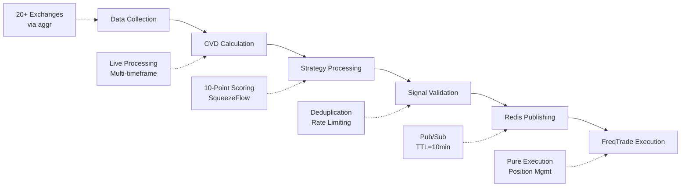
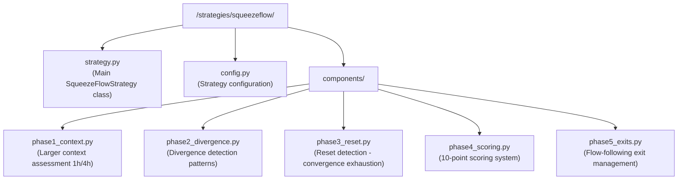
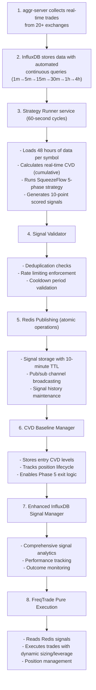
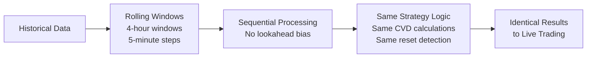

# SqueezeFlow Trader Signal Generation Workflow

## Overview

This document describes the complete signal generation pipeline for the SqueezeFlow Trader system, from raw market data collection through signal execution by FreqTrade. The system implements a sophisticated 5-phase trading methodology based on CVD divergence patterns between spot and futures markets.

## System Architecture



## 1. Data Collection Layer

### 1.1 Exchange Integration
The system collects real-time trading data from 20+ exchanges through the aggr-server:

**Data Sources:**
- **SPOT Markets**: Binance, Coinbase Pro, Kraken, etc. (47 BTC markets, 41 ETH markets)
- **FUTURES Markets**: Binance Futures, Bybit, OKX, etc. (16 BTC markets, 15 ETH markets)
- **Open Interest**: Real-time OI tracking from major derivatives exchanges

**Data Types Collected:**
```javascript
// aggr-server data structure
{
  symbol: "BTCUSDT",
  exchange: "BINANCE",
  price: 45000.0,
  size: 1.5,
  side: "buy",           // or "sell"
  timestamp: 1640995200000,
  type: "trade"
}
```

### 1.2 InfluxDB Storage Architecture
Data is stored in InfluxDB with automated continuous queries for multi-timeframe aggregation:

**Base Data Collection:**
```sql
-- Real-time 1-minute data from aggr-server
measurement: aggr_1m.trades_1m
tags: market, exchange_name
fields: open, high, low, close, vbuy, vsell, cbuy, csell, lbuy, lsell
```

**Automated Continuous Queries (5 CQs):**
```sql
-- 5-minute aggregation
CREATE CONTINUOUS QUERY "cq_5m" ON "significant_trades"
BEGIN
  SELECT first(open) AS open, max(high) AS high, min(low) AS low, last(close) AS close,
         sum(vbuy) AS vbuy, sum(vsell) AS vsell,
         sum(cbuy) AS cbuy, sum(csell) AS csell,
         sum(lbuy) AS lbuy, sum(lsell) AS lsell
  INTO "aggr_5m"."trades_5m" FROM "aggr_1m"."trades_1m"
  GROUP BY time(5m), market
END

-- Similar CQs for 15m, 30m, 1h, 4h timeframes
```

**Performance Benefits:**
- 10x faster queries vs real-time resampling
- Memory efficient - no pandas overhead during live trading
- Data consistency between backtest and live trading
- Automatic scaling for new timeframes

### 1.3 Dynamic Market Discovery
The system uses data-driven discovery instead of hardcoded market lists:

```python
# Symbol Discovery
active_symbols = symbol_discovery.discover_symbols_from_database(
    min_data_points=500,
    hours_lookback=24
)

# Market Discovery  
markets = market_discovery.get_markets_by_type('BTC')
# Result: {'spot': ['BINANCE:btcusdt', ...], 'perp': ['BINANCE_FUTURES:btcusdt', ...]}

# OI Discovery
oi_symbols = symbol_discovery.discover_oi_symbols_for_base('BTC')
```

## 2. CVD Calculation Engine

### 2.1 Industry-Standard CVD Formula
The system implements verified CVD calculation methodology:

```python
# VERIFIED CVD FORMULA (Industry Standard):
# Step 1: Calculate per-minute volume delta
volume_delta = vbuy - vsell  # Buy volume minus sell volume

# Step 2: Calculate CUMULATIVE Volume Delta (running total)
cvd = volume_delta.cumsum()  # Running total over time

# Critical: CVD is cumulative, not per-minute delta
```

### 2.2 Multi-Market CVD Aggregation
CVD calculation spans multiple exchanges per symbol:

```python
# BTC SPOT CVD (47 exchanges)
spot_markets = ['BINANCE:btcusdt', 'COINBASE:BTC-USD', 'KRAKEN:BTC/USD', ...]
spot_cvd = calculate_aggregated_cvd(spot_markets)

# BTC FUTURES CVD (16 exchanges)  
futures_markets = ['BINANCE_FUTURES:btcusdt', 'BYBIT:BTCUSDT', 'OKX:BTC-USDT-SWAP', ...]
futures_cvd = calculate_aggregated_cvd(futures_markets)

# CVD Divergence (Key metric)
cvd_divergence = futures_cvd - spot_cvd
```

### 2.3 Real-Time CVD Processing
In live trading, CVD is calculated in real-time by the Strategy Runner service:

```python
# services/strategy_runner.py - CVD calculation
spot_df['total_cvd_spot'] = spot_df['total_vbuy_spot'] - spot_df['total_vsell_spot']
spot_df = spot_df.set_index('time').sort_index()
spot_df['total_cvd_spot_cumulative'] = spot_df['total_cvd_spot'].cumsum()
spot_cvd = spot_df['total_cvd_spot_cumulative']  # Use cumulative CVD
```

## 3. SqueezeFlow Strategy Processing

### 3.1 Strategy Architecture
The strategy implements a modular 5-phase methodology:



### 3.2 Five-Phase Methodology

**Phase 1: Larger Context Assessment**
- Analyzes 1h/4h timeframes for dominant squeeze environment
- Identifies market direction and trend strength
- No fixed thresholds - qualitative analysis

**Phase 2: Divergence Detection**
- Detects CVD leadership patterns between spot and futures
- Pattern recognition over quantitative metrics
- Dynamic market baseline discovery

**Phase 3: Reset Detection**
- Identifies convergence exhaustion patterns (Reset Type A & B)
- Monitors CVD momentum deceleration
- Entry timing optimization

**Phase 4: 10-Point Scoring System**
```python
scoring_weights = {
    "cvd_reset_deceleration": 3.5,     # CVD momentum exhaustion
    "absorption_candle": 2.5,          # Buyer/seller absorption
    "failed_breakdown": 2.0,           # Multiple failed attempts
    "directional_bias": 2.0            # CVD direction alignment
}

# Entry Requirements
min_entry_score: 4.0
```

**Phase 5: Flow-Following Exits**
- No fixed stop losses or profit targets
- Dynamic exits based on market structure
- CVD trend invalidation monitoring

### 3.3 Position Sizing by Score
```python
# Dynamic position sizing based on signal score
if total_score >= 8.0:
    position_size_factor = 1.5  # Larger size
    leverage = 5                # High confidence
elif total_score >= 6.0:
    position_size_factor = 1.0  # Normal size
    leverage = 3                # Medium confidence
else:
    position_size_factor = 0.5  # Reduced size
    leverage = 2                # Low confidence
```

## 4. Signal Validation System

### 4.1 Signal Validator Architecture
```python
class SignalValidator:
    """Comprehensive signal validation and deduplication"""
    
    def __init__(self, config):
        self.config = {
            'max_signals_per_minute': 20,
            'max_signals_per_symbol_per_hour': 10,
            'signal_cooldown_minutes': 15,
            'cleanup_interval_hours': 12
        }
```

### 4.2 Validation Checks
**Primary Validations:**
- **Duplicate Detection**: Prevents duplicate signals within cooldown period
- **Rate Limiting**: Enforces maximum signals per minute/hour
- **Symbol Cooldown**: 15-minute cooldown between signals for same symbol
- **Score Validation**: Minimum score threshold (4.0)
- **Price Validation**: Entry price sanity checks

**Batch Validation:**
```python
# Batch signal validation for efficiency
batch_result = batch_validator.validate_batch(signals_to_process)
valid_signals = batch_result['valid_signals']
invalid_signals = batch_result['invalid_signals']

# Statistics tracking
batch_stats = {
    'valid_count': count,
    'duplicate_count': duplicates,
    'rate_limited_count': rate_limited,
    'expired_count': expired
}
```

### 4.3 Signal Deduplication
```python
def is_duplicate_signal(self, signal: Dict) -> bool:
    """Check for duplicate signals using multiple criteria"""
    
    # Hash-based deduplication
    signal_hash = self._calculate_signal_hash(signal)
    
    # Time-based deduplication
    last_signal_time = self._get_last_signal_time(signal['symbol'])
    
    # Price-based deduplication (within 1% price difference)
    similar_price_signals = self._find_similar_price_signals(signal)
    
    return any([hash_duplicate, time_duplicate, price_duplicate])
```

## 5. Redis Signal Publishing

### 5.1 Redis Architecture
```python
class OptimizedRedisClient:
    """High-performance Redis client with connection pooling"""
    
    def __init__(self):
        self.pool = ConnectionPool(
            host='redis',
            port=6379,
            max_connections=20,
            socket_keepalive=True
        )
        self.client = redis.Redis(connection_pool=self.pool)
```

### 5.2 Signal Format
```json
{
    "signal_id": "uuid-4",
    "timestamp": "2025-08-06T10:00:00Z",
    "symbol": "BTCUSDT",
    "base_symbol": "BTC",
    "action": "LONG",
    "score": 7.5,
    "position_size_factor": 1.0,
    "leverage": 3,
    "entry_price": 45000.0,
    "ttl": 600,
    "confidence": 0.85,
    "reasoning": "SqueezeFlow Phase 4 score: 7.5/10",
    "strategy": "SqueezeFlowStrategy",
    "service": "strategy_runner"
}
```

### 5.3 Publishing Strategy
**Immediate Publishing:**
```python
async def _publish_signal_immediately(self, signal: Dict):
    """Publish single signal with atomic Redis operations"""
    
    pipe = self.redis_client.pipeline()
    
    # 1. Set signal with TTL
    redis_key = f"squeezeflow:signal:{signal['symbol']}"
    pipe.setex(redis_key, signal['ttl'], signal_json)
    
    # 2. Publish to real-time channel
    channel = "squeezeflow:signals"
    pipe.publish(channel, signal_json)
    
    # 3. Add to signal history
    history_key = f"squeezeflow:history:{signal['symbol']}"
    pipe.lpush(history_key, signal_json)
    pipe.ltrim(history_key, 0, 99)  # Keep last 100 signals
    
    # 4. Update counters
    pipe.incr("squeezeflow:stats:signals_published")
    
    results = pipe.execute()
```

**Batch Publishing:**
```python
async def _flush_signal_batch(self):
    """Efficient batch publishing for multiple signals"""
    
    pipe = self.redis_client.pipeline()
    
    for signal in signals_batch:
        # Add all operations to pipeline
        pipe.setex(redis_key, signal['ttl'], signal_json)
        pipe.publish(channel, signal_json)
    
    # Execute all operations atomically
    results = pipe.execute()
```

### 5.4 Pub/Sub Channels
```python
# Channel structure
channels = {
    "squeezeflow:signals",     # All trading signals
    "squeezeflow:alerts",      # System alerts
    "squeezeflow:status",      # Status updates
    "squeezeflow:heartbeat"    # Service health
}

# Real-time distribution
def subscribe_to_signals(callback_function):
    pubsub = redis_client.pubsub()
    pubsub.subscribe("squeezeflow:signals")
    
    for message in pubsub.listen():
        callback_function(json.loads(message['data']))
```

## 6. Enhanced InfluxDB Signal Storage

### 6.1 Signal Storage Schema
```python
measurement: "strategy_signals"
tags: {
    symbol: str,              # "BTCUSDT"
    action: str,              # "LONG", "SHORT", "CLOSE"
    strategy: str,            # "SqueezeFlowStrategy"
    service: str,             # "strategy_runner"
    score_tier: str,          # "high", "medium", "low"
    confidence_tier: str      # "high", "medium", "low"
}
fields: {
    signal_id: str,           # Unique signal ID
    score: float,             # 10-point score
    position_size_factor: float,
    leverage: int,
    entry_price: float,
    confidence: float,
    reasoning: str,
    outcome: str,             # "pending", "profitable", "unprofitable"
    ttl_seconds: int,
    created_at: str,
    tracking_id: str
}
```

### 6.2 Signal Analytics
```python
class InfluxSignalManager:
    """Enhanced signal storage with analytics"""
    
    def get_signal_analytics(self, hours_back: int = 24) -> SignalAnalytics:
        """Comprehensive signal performance analytics"""
        
        query = f'''
            SELECT 
                COUNT(*) as total_signals,
                COUNT(CASE WHEN outcome = 'profitable' THEN 1 END) as profitable,
                MEAN(score) as avg_score,
                MEAN(pnl) as avg_pnl,
                SUM(pnl) as total_pnl
            FROM strategy_signals 
            WHERE time >= now() - {hours_back}h
        '''
```

### 6.3 Signal Outcome Tracking
```python
def update_signal_outcome(self, signal_id: str, outcome: SignalOutcome, 
                         exit_price: float = None, pnl: float = None):
    """Update signal outcome after trade completion"""
    
    # Calculate holding time
    holding_time = (exit_time - entry_time).total_seconds() / 60
    
    # Store outcome data
    outcome_point = {
        'measurement': 'strategy_signals',
        'fields': {
            'signal_id': signal_id,
            'outcome': outcome.value,
            'exit_price': exit_price,
            'pnl': pnl,
            'holding_time_minutes': holding_time
        }
    }
```

## 7. CVD Baseline Tracking System

### 7.1 Baseline Manager Architecture
```python
class CVDBaselineManager:
    """Tracks CVD levels at position entry for exit decisions"""
    
    def store_baseline(self, signal_id: str, trade_id: int, 
                      spot_cvd: float, futures_cvd: float):
        """Store CVD baseline when position opens"""
        
        baseline = CVDBaseline(
            trade_id=trade_id,
            signal_id=signal_id,
            entry_time=datetime.now(),
            spot_cvd=spot_cvd,
            futures_cvd=futures_cvd,
            cvd_divergence=futures_cvd - spot_cvd
        )
        
        # Store with 7-day TTL
        baseline_key = f"squeezeflow:cvd_baselines:trade:{trade_id}"
        self.redis_client.setex(baseline_key, 604800, json.dumps(baseline.to_dict()))
```

### 7.2 CVD Flow Analysis
```python
def calculate_cvd_flow_change(self, trade_id: int, 
                             current_spot_cvd: float, 
                             current_futures_cvd: float) -> Dict:
    """Calculate CVD flow change since position entry"""
    
    baseline = self.get_baseline(trade_id)
    if not baseline:
        return None
    
    # Calculate changes
    spot_change = current_spot_cvd - baseline.spot_cvd
    futures_change = current_futures_cvd - baseline.futures_cvd
    divergence_change = (current_futures_cvd - current_spot_cvd) - baseline.cvd_divergence
    
    return {
        'spot_cvd_change': spot_change,
        'futures_cvd_change': futures_change,
        'divergence_change': divergence_change,
        'flow_direction_maintained': self._check_flow_direction(baseline.side, divergence_change)
    }
```

### 7.3 Integration with Phase 5 Exits
```python
def should_exit_position(self, trade_id: int) -> bool:
    """Phase 5 exit decision based on CVD flow changes"""
    
    flow_metrics = self.calculate_cvd_flow_change(trade_id, current_spot, current_futures)
    
    # Exit conditions based on CVD flow invalidation
    if not flow_metrics['flow_direction_maintained']:
        return True
    
    # Additional exit logic based on CVD trend changes
    return False
```

## 8. FreqTrade Integration Layer

### 8.1 Pure Execution Architecture
FreqTrade has been simplified to a pure execution layer (reduced from 1300+ to 326 lines):

```python
class SqueezeFlowFreqAI(IStrategy):
    """Phase 5 - Pure Execution Layer"""
    
    def populate_indicators(self, dataframe, metadata):
        # Minimal indicators - only reads Redis signals
        return dataframe
        
    def populate_entry_trend(self, dataframe, metadata):
        # Execute based on Redis signal action (LONG/SHORT)
        signal = self.get_redis_signals(metadata['pair'])
        
        if signal and signal['action'] == 'LONG':
            dataframe.loc[dataframe.index[-1], 'enter_long'] = 1
            
        return dataframe
```

### 8.2 Signal Consumption
```python
def get_redis_signals(self, pair: str) -> Optional[Dict]:
    """Read signals from Redis for execution"""
    
    redis_key = f"squeezeflow:signal:{pair}"
    signal_data = self.redis_client.get(redis_key)
    
    if signal_data:
        signal = json.loads(signal_data)
        
        # Prevent duplicate execution with signal tracking
        if not self._is_signal_already_executed(signal['signal_id']):
            return signal
    
    return None
```

### 8.3 Position Management
```python
def custom_entry_price(self, pair: str, current_time, proposed_rate, **kwargs) -> float:
    """Dynamic entry pricing based on signal data"""
    
    signal = self.get_redis_signals(pair)
    if signal:
        # Use signal entry price with small buffer
        signal_price = signal.get('entry_price', proposed_rate)
        return signal_price * 1.001  # 0.1% buffer for market execution
    
    return proposed_rate

def leverage(self, pair: str, current_time, current_rate, **kwargs) -> float:
    """Dynamic leverage based on signal score"""
    
    signal = self.get_redis_signals(pair)
    if signal:
        return signal.get('leverage', 1)
    
    return 1
```

## 9. System Performance & Monitoring

### 9.1 Performance Metrics
```python
performance_stats = {
    'cycles_completed': 0,
    'signals_generated': 0,
    'signals_published': 0,
    'signals_failed': 0,
    'signals_duplicate': 0,
    'signals_rate_limited': 0,
    'batch_published': 0,
    'errors_encountered': 0,
    'last_cycle_duration': 0.0,
    'avg_cycle_duration': 0.0,
    'redis_publish_time': 0.0,
    'validation_time': 0.0
}
```

### 9.2 Health Monitoring
```python
def get_health_status(self) -> Dict:
    """Comprehensive service health status"""
    
    return {
        'service': 'strategy_runner',
        'status': 'running' if self.is_running else 'stopped',
        'performance': self.performance_stats,
        'redis_metrics': self._redis_metrics,
        'validation_metrics': self.signal_validator.get_metrics(),
        'connections': {
            'redis_main': self._redis_client is not None,
            'influxdb': self._influx_client is not None,
            'freqtrade_api': self._freqtrade_client is not None
        }
    }
```

### 9.3 Real-Time Monitoring Dashboard
```python
class SignalMonitorDashboard:
    """Real-time signal monitoring and analytics"""
    
    def get_signal_flow_status(self):
        """Monitor complete signal flow from generation to execution"""
        
        return {
            'data_collection_health': self._check_aggr_server_status(),
            'cvd_calculation_status': self._check_cvd_processing(),
            'strategy_processing': self._check_strategy_runner(),
            'signal_validation': self._check_validator_metrics(),
            'redis_publishing': self._check_redis_health(),
            'freqtrade_execution': self._check_freqtrade_status()
        }
```

## 10. Signal Flow Summary

### 10.1 Complete Pipeline Flow


### 10.2 Timing and Performance
- **Data Collection**: Real-time (< 100ms latency)
- **CVD Calculation**: Real-time processing (< 500ms)
- **Strategy Processing**: 60-second cycles, ~2-5 seconds per symbol
- **Signal Validation**: < 50ms for single signals, < 200ms for batches
- **Redis Publishing**: < 10ms for immediate, < 100ms for batches
- **FreqTrade Execution**: Variable (exchange-dependent), typically < 1 second

### 10.3 Scalability Metrics
- **Supported Symbols**: Unlimited (data-driven discovery)
- **Max Signals/Minute**: 20 (configurable rate limiting)
- **Concurrent Positions**: 5 (risk management)
- **Data Retention**: 30 days rolling window
- **Signal History**: 100 signals per symbol
- **Performance Target**: 95%+ signal success rate, <5% error rate

---

## Configuration Examples

### Strategy Runner Environment
```bash
SQUEEZEFLOW_RUN_INTERVAL=60
SQUEEZEFLOW_MAX_SYMBOLS=5
SQUEEZEFLOW_LOOKBACK_HOURS=48
SQUEEZEFLOW_TIMEFRAME=5m
REDIS_HOST=redis
INFLUX_HOST=aggr-influx
FREQTRADE_API_URL=http://freqtrade:8080
```

### Redis Signal Keys
```
squeezeflow:signal:BTCUSDT          # Current signal
squeezeflow:history:BTCUSDT         # Signal history (last 100)
squeezeflow:stats:signals_published # Global counters
squeezeflow:cvd_baselines:trade:123 # CVD baseline for trade 123
```

This comprehensive workflow ensures reliable signal generation with institutional-grade performance monitoring and error handling capabilities.

## 11. Backtest vs Live Trading Processing

### Rolling Window Backtest Processing
The backtest engine now uses **rolling window processing** that exactly matches live trading behavior:



### Processing Method Comparison
| Component | Rolling Window Backtest | Live Trading |
|-----------|------------------------|--------------|
| Data Source | Historical from InfluxDB | Real-time from InfluxDB |
| Data Processing | **4-hour windows, 5-min steps** | **4-hour windows, 5-min steps** |
| CVD Calculation | Same sequential processing | Same sequential processing |
| Reset Detection | **Works correctly with windowed data** | **Works correctly with real-time data** |
| Strategy Execution | Same 5-phase methodology | Same 5-phase methodology |
| CVD Storage | FakeRedis (in-memory) | Redis (persistent) |
| Signal Generation | Same 10-point scoring | Same 10-point scoring |
| Execution | Simulated with fees | FreqTrade API |
| Latency | None (instant processing) | Network latency (~100ms) |
| Slippage | Configurable simulation | Market reality |
| Strategy Behavior | **Identical to live (no lookahead)** | **Live market conditions** |

### Major Fix: Reset Detection Now Works
**Problem Before**: Reset detection in Phase 3 often failed in backtests because the strategy could see entire datasets at once, preventing natural convergence pattern development.

**Solution - Rolling Windows**: Reset detection now works correctly because:
- CVD convergence exhaustion develops gradually over time
- Market structure changes become visible step-by-step  
- Reset Type A and B patterns are detected in proper sequence
- Entry timing becomes realistic and matches live trading behavior

### Backtest-Live Parity Benefits
```yaml
Accuracy:
  - Backtest results now highly predictive of live performance
  - Strategy behavior identical between backtest and live
  - Reset detection works correctly in both environments
  - No more "works in backtest but fails live" scenarios

Development:
  - Same strategy code runs in both environments
  - No backtest-specific modifications needed
  - Faster development cycle with reliable testing
  - Confident deployment after backtest validation

Risk Management:
  - Realistic position sizing and risk assessment
  - Accurate drawdown calculations
  - Proper correlation between backtest and live results
  - Reliable performance projections
```

This ensures that strategies validated through backtesting will perform similarly in live trading conditions, eliminating the disconnect between backtest and live results.