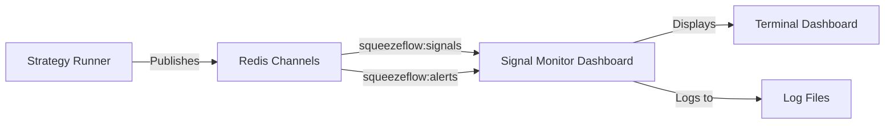

# Signal Monitor Dashboard

The Signal Monitor Dashboard provides real-time visual monitoring of trading signals as they flow through the SqueezeFlow Trader system. It serves as a "trading control tower" for monitoring signal generation, quality, and system health.

## Overview

The Signal Monitor Dashboard is a terminal-based real-time dashboard that subscribes to Redis pub/sub channels to monitor signals published by the Strategy Runner service. It provides immediate visual feedback on trading activity, signal quality, and system performance.

### Key Features

- **Real-time Signal Feed**: Live monitoring of signals as they're generated
- **Signal Analytics**: Comprehensive metrics on signal quality and patterns
- **Visual Dashboard**: ASCII-based terminal interface with live updates
- **Symbol Activity Tracking**: Monitor which symbols are most active
- **System Health Integration**: Redis connectivity and Strategy Runner status
- **Signal History**: Recent signal tracking with full details

## Architecture



### Redis Integration

The dashboard subscribes to multiple Redis channels:
- `squeezeflow:signals` - Trading signals from Strategy Runner
- `squeezeflow:alerts` - System alerts
- `squeezeflow:performance_alerts` - Performance-related alerts

### Signal Format Compatibility

Compatible with the current Strategy Runner signal format:
```json
{
  "signal_id": "uuid",
  "timestamp": "2025-01-15T23:00:00Z",
  "symbol": "BTCUSDT",
  "base_symbol": "BTC",
  "action": "LONG",
  "score": 7.2,
  "position_size_factor": 1.5,
  "leverage": 5,
  "entry_price": 50000.0,
  "confidence": 0.85,
  "reasoning": "SqueezeFlow signal"
}
```

## Docker Configuration

### Service Definition

```yaml
# docker-compose.yml
signal-monitor-dashboard:
  container_name: squeezeflow-signal-dashboard
  build:
    context: .
    dockerfile: docker/Dockerfile.squeezeflow
  command: python services/signal_monitor_dashboard.py
  restart: unless-stopped
  environment:
    - REDIS_HOST=redis
    - REDIS_PORT=6379
    - LOG_LEVEL=INFO
  depends_on:
    - redis
    - strategy-runner
  networks:
    - squeezeflow_network
  volumes:
    - ./data/logs:/app/data/logs
  tty: true  # Required for terminal dashboard
  stdin_open: true
```

### Environment Variables

| Variable | Default | Description |
|----------|---------|-------------|
| `REDIS_HOST` | localhost | Redis server hostname |
| `REDIS_PORT` | 6379 | Redis server port |
| `LOG_LEVEL` | INFO | Logging level |

## Usage

### Starting the Dashboard

```bash
# Start with monitoring script
./scripts/start_monitoring.sh

# Or start individually
docker-compose up -d signal-monitor-dashboard
```

### Viewing the Dashboard

```bash
# Attach to the live terminal dashboard
docker attach squeezeflow-signal-dashboard

# Detach without stopping: Ctrl+P, Ctrl+Q
# Stop dashboard: Ctrl+C
```

### Monitoring Commands

```bash
# View dashboard logs
docker-compose logs -f signal-monitor-dashboard

# Restart dashboard
docker-compose restart signal-monitor-dashboard

# View Redis signal stats
redis-cli GET "squeezeflow:stats:signals_published"
```

## Dashboard Display

### Sample Dashboard Output

```
═══════════════════════════════════════════════════════════════════════════════
📊 SQUEEZEFLOW SIGNAL MONITOR DASHBOARD
⏰ 2025-01-15 23:00:00 | ⏱️  Uptime: 0:15:30
═══════════════════════════════════════════════════════════════════════════════

📈 LIVE METRICS
   Signals Received: 47
   Unique Symbols: 5
   Signals/Minute: 12
   Avg Signal Score: 6.8
   Long/Short: 28/19
   High Quality (≥7): 15
   Last Signal: 3s ago

🔔 RECENT SIGNALS (Last 10)
   Time     | Symbol    | Action | Score | Size | Lev | Price    | ID
   ---------------------------------------------------------------------------
   23:00:01 | BTC       | LONG   |   7.2 |  1.5 |   5 | 50000.00 | a1b2c3d4
   22:59:58 | ETH       | SHORT  |   6.1 |  1.0 |   3 |  3200.00 | e5f6g7h8
   22:59:45 | BTC       | LONG   |   8.5 |  1.5 |   5 | 49950.00 | i9j0k1l2

💹 SYMBOL ACTIVITY
   BTC      | 15 | ████████████████████
   ETH      | 12 | ██████████████████
   SOL      |  8 | ████████████
   ADA      |  5 | ██████

🏥 SYSTEM HEALTH
   Redis: 🟢 Connected
   Clients: 8
   Memory: 45.2MB
   Commands: 125,847
   Published Signals: 1,247
   Symbols w/ History: 12
   Strategy Runner: 🟢 Active

═══════════════════════════════════════════════════════════════════════════════
Press Ctrl+C to stop monitoring | Refresh: 5s
```

### Dashboard Sections

#### 1. Live Metrics
- **Signals Received**: Total signals processed since startup
- **Unique Symbols**: Number of different trading symbols seen
- **Signals/Minute**: Current rate of signal generation
- **Avg Signal Score**: Average quality score of all signals
- **Long/Short**: Breakdown of signal directions
- **High Quality (≥7)**: Count of high-confidence signals
- **Last Signal**: Time since most recent signal

#### 2. Recent Signals
Displays the last 10 signals with:
- **Time**: When the signal was received
- **Symbol**: Trading symbol (base symbol format)
- **Action**: LONG or SHORT
- **Score**: Signal quality score (0-10)
- **Size**: Position size factor
- **Lev**: Leverage multiplier
- **Price**: Entry price
- **ID**: Signal ID (first 8 characters)

#### 3. Symbol Activity
Bar chart showing signal frequency by symbol:
- Most active symbols at the top
- Visual bar representation of activity level
- Signal count for each symbol

#### 4. System Health
- **Redis**: Connection status and performance metrics
- **Strategy Runner**: Activity status
- **Published Signals**: Total signals published by Strategy Runner
- **Symbols w/ History**: Number of symbols with signal history

## Integration Benefits

### For Traders
- **Real-time Validation**: Immediate confirmation that signals are being generated
- **Quality Monitoring**: Track signal scores and identify high-quality setups
- **Symbol Insights**: See which symbols are most active in current market conditions
- **Performance Tracking**: Monitor signal generation rate and consistency

### For Developers
- **Debug Tool**: Visual confirmation of signal flow from Strategy Runner to FreqTrade
- **System Validation**: Verify Redis pub/sub channels are working correctly
- **Data Verification**: Ensure signal format and content are correct
- **Performance Analysis**: Monitor system responsiveness and throughput

### For Operations
- **Health Monitoring**: Real-time system status and connectivity
- **Issue Detection**: Immediate visibility when signal generation stops
- **Performance Metrics**: Track system capacity and usage patterns
- **Historical Analysis**: Review recent signal patterns and trends

## Configuration

### Dashboard Settings

The dashboard can be configured by modifying `services/signal_monitor_dashboard.py`:

```python
# Display settings
self.max_recent_signals = 50        # Number of recent signals to store
self.max_history_per_symbol = 20    # Signal history per symbol
self.refresh_interval = 5           # Dashboard refresh rate (seconds)
```

### Signal Filtering

Customize which signals are displayed:

```python
# Score thresholds
HIGH_SCORE_THRESHOLD = 7.0  # Signals considered "high quality"
MIN_DISPLAY_SCORE = 0.0     # Minimum score to display
```

## API Access

### Dashboard Summary API

The dashboard exposes a programmatic interface for external access:

```python
from services.signal_monitor_dashboard import SignalMonitorDashboard

dashboard = SignalMonitorDashboard()
summary = dashboard.get_dashboard_summary()

# Returns:
{
    'timestamp': '2025-01-15T23:00:00Z',
    'uptime_seconds': 930,
    'metrics': {
        'signals_received': 47,
        'unique_symbols': 5,
        'signals_per_minute': 12,
        'avg_signal_score': 6.8,
        'long_signals': 28,
        'short_signals': 19,
        'high_score_signals': 15
    },
    'recent_signals_count': 10,
    'symbols_tracked': 5,
    'is_running': True
}
```

## Troubleshooting

### Common Issues

#### Dashboard Not Showing Signals
```bash
# Check Strategy Runner is running
docker ps | grep strategy-runner

# Check Redis connectivity
redis-cli ping

# Verify Redis channels
redis-cli PSUBSCRIBE "squeezeflow:*"

# Check dashboard logs
docker-compose logs signal-monitor-dashboard
```

#### Dashboard Display Issues
```bash
# Ensure terminal supports ANSI colors
export TERM=xterm-256color

# Check container has tty access
docker inspect squeezeflow-signal-dashboard | grep -A 10 "Tty"

# Restart with proper tty settings
docker-compose down signal-monitor-dashboard
docker-compose up -d signal-monitor-dashboard
```

#### No Signal History
```bash
# Check Redis signal keys
redis-cli KEYS "squeezeflow:history:*"

# Check signal publication
redis-cli GET "squeezeflow:stats:signals_published"

# Verify Strategy Runner is publishing
docker-compose logs strategy-runner | grep "Published signal"
```

### Performance Optimization

#### High Memory Usage
```bash
# Reduce signal history
# Edit signal_monitor_dashboard.py:
self.max_recent_signals = 25
self.max_history_per_symbol = 10
```

#### Slow Dashboard Updates
```bash
# Increase refresh interval
# Edit signal_monitor_dashboard.py:
self.refresh_interval = 10  # Update every 10 seconds
```

## Monitoring Integration

### Health Monitor Integration

The Signal Monitor Dashboard integrates with the Health Monitor service:
- Health status accessible via `http://localhost:8090/health/service/strategy_runner`
- Dashboard status included in comprehensive health reports
- Redis connectivity monitored by Health Monitor

### Performance Monitor Integration

Works alongside Performance Monitor for comprehensive system observability:
- Signal generation performance tracked by Performance Monitor
- Dashboard provides trading-specific metrics
- Complementary alerting systems for different aspects of the system

## Future Enhancements

### Planned Features
- **Web-based Dashboard**: HTTP interface for remote access
- **Signal Filtering**: Filter by symbol, score, or time range
- **Export Functionality**: Save signal data to CSV/JSON
- **Alert Integration**: Custom alerts for specific signal patterns
- **Historical Analysis**: Extended signal history and trend analysis

### API Extensions
- **REST API**: HTTP endpoints for dashboard data
- **WebSocket Stream**: Real-time signal streaming
- **Webhook Integration**: Push notifications to external systems
- **Grafana Integration**: Dashboard for visualization platforms

## Related Documentation

- [Monitoring Services](monitoring_services.md) - Complete monitoring system overview
- [System Overview](system_overview.md) - Full system architecture
- [Docker Services](docker_services.md) - Container deployment guide
- [Strategy Runner](../services/README.md) - Signal generation service

The Signal Monitor Dashboard is an essential tool for any serious trading operation, providing immediate visual feedback on system performance and trading activity. It serves as your "mission control" for monitoring the SqueezeFlow Trader system in real-time.